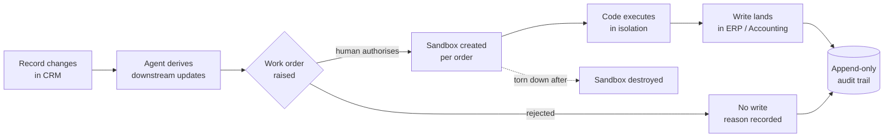

# Ledgerline

**Enterprise data gets typed three times. Ledgerline types it once — and no write happens
until a human authorises it.**

Built for the **[SF Enterprise Hackathon](https://luma.com/ev9ndfke)**, 2026-08-14 ·
Track: **Workflow Automation**
Built on **[SoftwareForge](https://softwareforge.ai/)** · Runs on **[Daytona](https://www.daytona.io/)**

---

## Try it

| | |
|---|---|
| **Live prototype** | _`<!-- TODO: hosted URL -->`_ |
| **Demo video** | _`<!-- TODO: 2–3 min walkthrough, recorded from the Daytona environment -->`_ |
| **Team** | _`<!-- TODO: team name + members -->`_ |

---

## The problem

A single new customer or order is entered by sales into the CRM, re-typed by operations into
the ERP, then exported by finance into a spreadsheet. **The same facts, keyed three times.**

Three costs, in increasing severity:

1. **Time.** Over **nine hours per week per employee** transferring data by hand, ≈ **$28,500
   per employee per year**.
   <sub>Parseur × QuestionPro, Jul 2025, n=500 US professionals — *vendor-commissioned survey,
   verified at source. Directional, not precise.*</sub>
2. **Errors.** Every re-key is a chance for systems to diverge. **66%** of organisations still
   manually enter invoice data into ERP; **63%** of AP teams spend >10 hrs/week on it.
   <sub>IFOL AP Automation Trends 2025 — *vendor-sponsored industry survey, verified at source.*</sub>
3. **Loss of trust in the data.** Once systems disagree, teams stop believing any of them and
   fall back to spreadsheets. That is how the manual work becomes *permanent* rather than
   transitional.

### Why the obvious fix hasn't landed

Point-to-point integrations and RPA both **write autonomously**. Finance, compliance and
operations owners will not grant an autonomous process write access to a system of record
without an answer to *"who approved this, and what exactly did it do?"* So the integration
gets scoped down to read-only, or shelved — and the re-keying survives.

**The blocker is governance, not capability.** That is the gap Ledgerline is built for.

---

## How it works

Every propagation is a **work order**: a discrete, human-readable unit of proposed change —
target system, field-level diff, derivation rationale, and the exact code that will run.
Nothing is written until a human authorises it.



**The invariant:** if a code path can write without an authorised order, that is a
top-severity defect — not a convenience trade-off.

---

## Built on Forge & Daytona

Both platforms are **structural**. Remove either and the product stops working as specified.

### Forge — where it's specified and built

- The requirement is authored as a **Living Specification** on-platform; its version history
  is the record of how the design evolved.
- Frontend and backend are generated and iterated **through Forge** — rapid generation, then
  refinement against enterprise constraints.
- Forge's **work-order model** is the same primitive the product exposes to its users, so the
  governance concept runs end-to-end: our spec is authorised the way our writes are.

### Daytona — where generated code is allowed to run

- **A sandbox is created per authorised work order**, executes the agent-generated
  integration code, and is **destroyed afterward**. Agent-written code never runs in the
  application process.
- **Parallel experimentation** — multiple sandboxes trying different sync strategies
  side-by-side; the losers are discarded at zero cleanup cost.
- **Snapshots** make the demo reproducible: what you see is the build that went green.

```python
def execute_authorized_order(order):
    """Only reachable after a human authorises the work order."""
    sandbox = daytona.create(...)
    try:
        return sandbox.process.code_run(order.generated_code)
    finally:
        sandbox.delete()
```

Isolation here is a **security property of the product**, not a deployment detail. That is
what makes Daytona load-bearing rather than a box we happened to run in.

---

## Impact

| | |
|---|---|
| **Baseline** | >9 hrs/week/employee on manual transfer · ≈$28,500/employee/yr |
| **Demonstrated** | **66% fewer re-keying events per record** — three manual entries collapse to one, shown live |
| **Projected** | ~80% at full connector coverage — *projection, not measured* |

Every figure above carries its source type. Vendor-commissioned surveys are labelled as such
rather than presented as neutral fact.

---

## Run it

```bash
uv venv && uv pip install -e .        # Python 3.12+
cp .env.example .env                  # add DAYTONA_API_KEY + DAYTONA_API_URL
bash scripts/restart.sh               # serves on http://127.0.0.1:8000
uv run python scripts/e2e.py          # the eight success criteria, executable
```

`/` lists the eight Forge-designed screens and the live API. The end-to-end run
creates a real Daytona sandbox per authorised work order and destroys it after.

| Endpoint | What |
|---|---|
| `POST /systems/crm/records/{id}` | Edit the source of truth — this is the trigger |
| `GET /api/v1/workorders` | Derived orders with field diffs, rationale, and the code to run |
| `POST /api/v1/workorders/{id}/approve` | Authorise, execute in a sandbox, write downstream |
| `POST /api/v1/workorders/{id}/reject` | Refuse, with a reason, recorded permanently |
| `GET /api/v1/audit` | Append-only trail with SHA-256 chain verification |
| `GET /api/v1/audit/trace/{system}/{id}` | A written record back to its authorising order |

`POST /systems/erp/records/{id}` without a token minted by an approval returns
**403**. That is the product's central invariant, enforced in the write path.

---

## Repo map

| Path | What |
|---|---|
| `docs/forge-intent.md` | The Intent given to Forge — problem, users, scope, constraints, acceptance |
| `docs/problem-shortlist.md` | Five enterprise pain points ranked by ROI, with sourced evidence |
| `docs/estate-correlation.md` | Ingest analysis: hackathon reference architecture and judging criteria |
| `docs/plans/0001-governed-sync-agent.md` | Build plan, remaining-work table, open decisions |
| `docs/handoffs/0001-governed-sync-agent.md` | Session handoff |
| `docs/SoftwareForge.ai-EnterpriseHack-SF/` | Forge pipeline output: Intent, BRD, PRD, Architecture, UI Design |
| `src/ledgerline/app.py` | The agent: detection, derivation, authorisation, sandboxed execution, audit |
| `ui/` | The eight Forge-designed screens, extracted from `UI_Design.md` |
| `scripts/e2e.py` | The eight success criteria as executable checks |
| `assets/` | Problem statement |

---

## Scope, stated honestly

**In:** change detection · target derivation · work orders with field-level diffs ·
approve/reject/amend · sandboxed execution · append-only audit trail · three systems
(CRM, ERP, Accounting).

**Out:** real SaaS tenancy or production credentials (the three systems are lightweight
services sharing one record schema) · bidirectional conflict resolution · RBAC beyond a
single approver role · historical backfill.

**Deliberately absent:** there is **no auto-approve mode**. Human authorisation is the
feature, not a limitation to be removed later.

---

## Licence

See [LICENSE](LICENSE) if present; otherwise all rights reserved by the team pending
selection.
