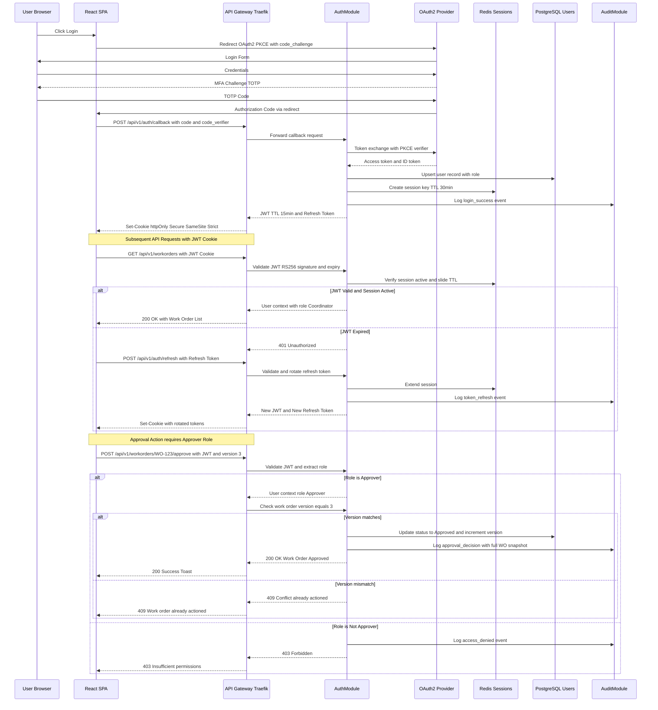
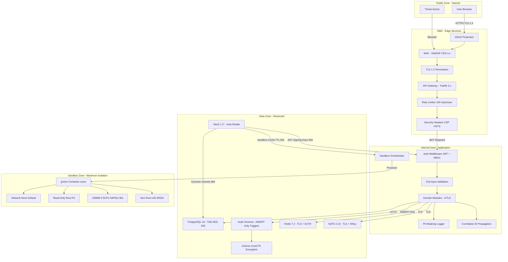
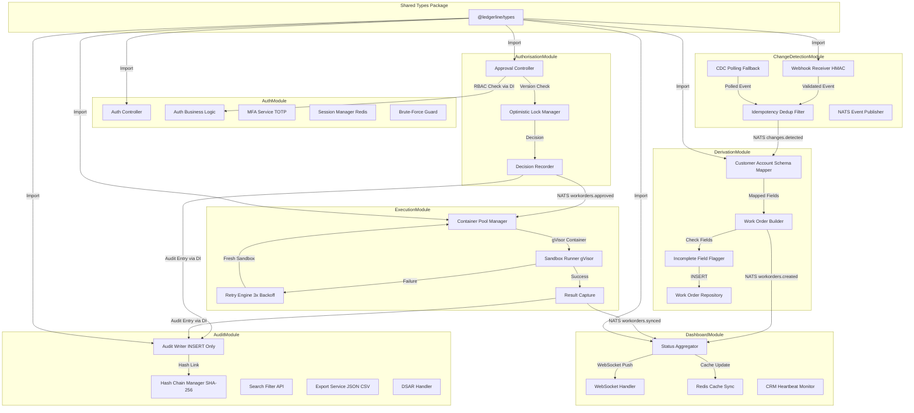
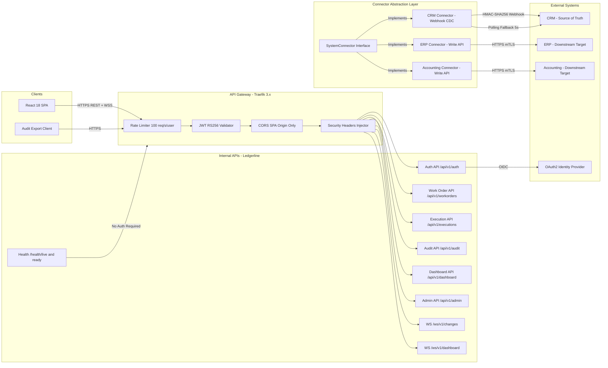
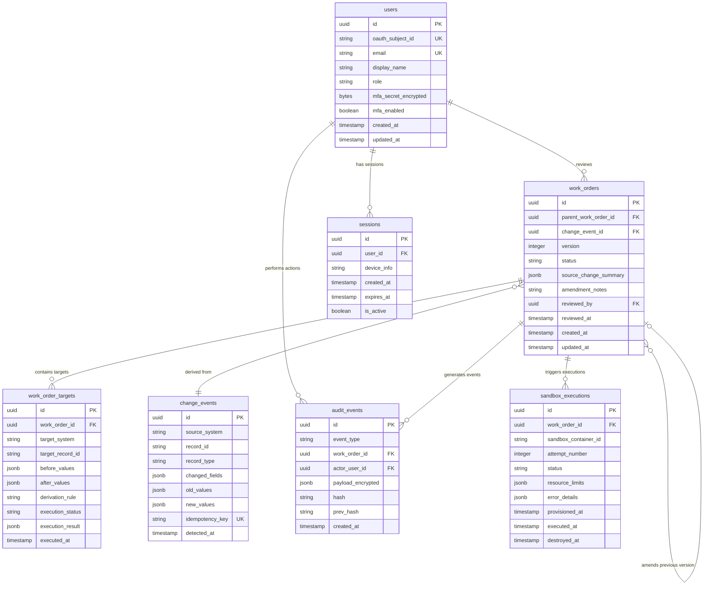

## Architecture Executive Summary

### Project Context

Ledgerline is a greenfield internal workflow agent designed to eliminate duplicate manual data entry across three disconnected enterprise systems — CRM, ERP, and Accounting. It operates in the enterprise integration and workflow automation domain, serving four distinct personas: **Operations Coordinators** (eliminate re-keying), **Finance/AP Reviewers** (authorise every write), **Compliance/Audit Observers** (reconstruct authorisation history), and **IT Owners** (verify execution isolation). The system must comply with SOC 2 Trust Service Criteria and GDPR from day one.

The initial delivery targets the thinnest viable end-to-end slice: a Customer/Account master record change detected in CRM, derived into work orders for ERP and Accounting, reviewed and approved by a human, executed in an isolated sandbox, and permanently recorded in an immutable audit trail — all within a five-week Phase 1 window (target: 22 September 2026).

### Architectural Philosophy

The architecture is governed by five guiding principles:

1. **Human Authority at Every Write Boundary** — No data is written to any downstream system without an explicitly approved work order. This constraint outranks throughput, latency, and convenience. The architecture enforces this through a mandatory HITL gate between derivation and execution, with optimistic locking to prevent duplicate approvals.

2. **Immutability as a First-Class Property** — The audit trail is append-only by construction, not convention. Database-level triggers block UPDATE and DELETE on audit tables. Cryptographic hash chains (SHA-256) provide tamper evidence. This satisfies SOC 2 processing integrity and GDPR Article 30 record-keeping.

3. **Isolation by Default** — Every sandbox execution runs in a dedicated, disposable container with no access to the host process, other sandboxes, or unrelated network resources. gVisor provides kernel-level isolation beyond standard Docker containers. Sandbox lifecycle (create → execute → destroy) is audited.

4. **Event-Driven, Decoupled Services** — Backend services communicate through an event bus (NATS JetStream) for durability and ordering guarantees. The UI is a fully independent SPA that consumes REST APIs and WebSocket streams. Backend and frontend can be developed, tested, and released on separate timelines.

5. **Operability Over Elegance** — Every component is observable (structured logging, distributed tracing, health checks), debuggable (correlation IDs on every request), and recoverable (automated retries, circuit breakers, pre-warmed sandbox pools). Mean-time-to-recovery is a design target, not an afterthought.

### Key Decisions

| Decision | Choice | Alternatives Considered | Rationale |
|----------|--------|------------------------|-----------|
| Service architecture | Modular monolith with clear domain boundaries | Microservices, serverless functions | Five-week Phase 1 delivery requires minimal operational overhead; domain boundaries are enforced via module interfaces and can be extracted to microservices in Phase 2+ |
| Primary database | PostgreSQL 16 | MySQL 8, MongoDB 7, CockroachDB | Mature append-only trigger support, JSONB for flexible schema, row-level security for RBAC, proven SOC 2 audit patterns |
| Audit trail storage | Append-only PostgreSQL tables with SHA-256 hash chains | immudb, Amazon QLDB, EventDBX | PostgreSQL avoids introducing a second database engine for Phase 1; hash chains provide cryptographic tamper evidence; migration to dedicated immutable DB possible in Phase 2 |
| Event bus | NATS JetStream 2.10 | RabbitMQ 3.13, Apache Kafka 3.7, Redis Streams | Lightweight, supports exactly-once delivery, durable streams, built-in replay; lower operational burden than Kafka for initial scale |
| Sandbox runtime | Docker containers with gVisor (runsc) | Firecracker microVMs, Kata Containers, WASM | gVisor provides kernel-level isolation with sub-second cold start; Docker ecosystem maturity reduces integration risk; Firecracker considered for Phase 2 if scale demands it |
| Frontend framework | React 18 with TypeScript strict mode | Vue 3, Angular 17, Svelte 5 | Largest ecosystem for enterprise UIs; strict TypeScript aligns with tenant coding standards; Mantine 7 component library accelerates WCAG 2.1 AA compliance |
| Backend runtime | Node.js 20 LTS with TypeScript + Fastify 5 | Go 1.22, Python 3.12/FastAPI, Java 21/Spring Boot | TypeScript across frontend and backend reduces context-switching; strong typing satisfies tenant policy; async I/O suits event-driven architecture; Fastify's schema-based validation aligns with input sanitisation policy |
| Authentication | OAuth 2.0 with PKCE + TOTP MFA | SAML 2.0, custom JWT-only, Passkeys | OIDC/OAuth 2.0 is mandated by tenant policy (A07); PKCE prevents authorization code interception; TOTP MFA required for Approver role per PRD AU-BE-001 |
| Secrets management | HashiCorp Vault 1.17 | AWS Secrets Manager, Azure Key Vault, Doppler | Cloud-agnostic; supports automatic 90-day rotation; runtime injection via sidecar; satisfies tenant secrets management policy |
| IaC tooling | Terraform 1.9 | Pulumi, AWS CDK, OpenTofu | Widest provider support; declarative; mature state management; aligns with platform engineering automation-first principle |

### Intent Alignment

- **Change Detection** → Event-driven CDC listener on CRM publishing to NATS JetStream `changes.detected` stream with ≤2s latency and idempotency-key deduplication
- **Work Order Derivation** → Deterministic derivation engine consuming change events, producing versioned work orders with field-level before/after values stored as JSONB
- **Human Authorisation** → Mandatory HITL gate with single-approver RBAC, optimistic locking via version counter, and full audit capture on every decision
- **Sandboxed Execution** → One gVisor-isolated Docker container per approved work order, pre-warmed pool for ≤3s provisioning, 30s hard timeout, auto-retry 3x with exponential backoff (1s, 2s, 4s)
- **Immutable Audit Trail** → Append-only PostgreSQL with database-level INSERT-only enforcement via triggers, SHA-256 hash chains, 7-year retention with cryptographic erasure after expiry
- **Dashboard** → Real-time aggregation via NATS subscription with Redis-cached counts, WebSocket push to SPA within 2s of any status change

```mermaid

```

---

## System Architecture Overview

### Architecture Layers

The proposed Ledgerline architecture follows a four-layer model: **Client Layer** (React SPA), **Edge Layer** (CDN, WAF, API Gateway), **Service Layer** (seven domain modules within a modular monolith), and **Data Layer** (PostgreSQL, NATS JetStream, Redis, Docker/gVisor sandbox pool).

### Client Layer
A single React 18 SPA served via CDN-backed static hosting. The SPA communicates with the backend exclusively through the API Gateway over HTTPS/443. Real-time updates (change feed, dashboard status changes) are delivered via WebSocket connections upgraded at the gateway. The SPA uses TanStack Query 5 for server-state management with automatic cache invalidation on WebSocket events.

### Edge Layer
- **CDN** serves static assets (JS bundles, CSS, images) with cache-control headers and SRI hashes
- **WAF** with OWASP Core Rule Set blocks SQLi, XSS, SSRF, and other common attack patterns
- **API Gateway (Traefik 3.x)** terminates TLS 1.3, enforces rate limiting (100 req/s per user, 1000 req/s global), validates JWT tokens on every request, injects security headers (CSP, HSTS max-age=31536000, X-Content-Type-Options, X-Frame-Options), and routes requests to backend modules

### Service Layer — Modular Monolith
Seven domain modules deployed as a single Node.js process with strict interface boundaries enforced by ESLint import rules:

1. **AuthModule** — OAuth 2.0/OIDC authentication, TOTP MFA enrolment and verification, session management (Redis-backed, 30min inactivity / 8hr absolute timeout, max 3 concurrent), RBAC enforcement middleware
2. **ChangeDetectionModule** — CDC listener on CRM via webhook with HMAC-SHA256 validation (polling fallback every 5s), event deduplication via idempotency key, structured ChangeEvent publishing to NATS `changes.detected` stream
3. **DerivationModule** — Consumes change events from NATS, applies shared Customer/Account schema mapping, produces versioned work orders with field-level before/after JSONB values, flags unmapped fields as "Incomplete"
4. **AuthorisationModule** — Approve/reject/amend REST endpoints with single-approver RBAC (deny-by-default, HTTP 403 for non-Approver), optimistic locking via version counter (HTTP 409 on conflict), full work order snapshot captured in audit on every decision
5. **ExecutionModule** — Sandbox lifecycle orchestration: provision pre-warmed gVisor container → inject credentials from Vault → execute derived writes against real downstream endpoints → capture results → destroy sandbox. Auto-retry 3x with exponential backoff (1s, 2s, 4s), each retry in fresh sandbox
6. **AuditModule** — Append-only persistence with SHA-256 hash chain, search/filter API (≤500ms for ≤100 results, paginated default 25 / max 100), JSON/CSV export restricted to Observer/Approver role, GDPR DSAR endpoint
7. **DashboardModule** — Subscribes to all `workorders.*` NATS streams, maintains aggregated counts in Redis, pushes real-time updates via WebSocket within 2s of status change

### Data Layer
- **PostgreSQL 16** — Primary relational store with two schemas: `app` (work orders, users, sessions, change events) and `audit` (immutable audit trail with INSERT-only permissions enforced via triggers). TDE encryption (AES-256), TLS connections, parameterised queries only
- **NATS JetStream 2.10** — Durable event bus with file-based storage, exactly-once delivery, consumer acknowledgement with redelivery, dead-letter queue for poison messages
- **Redis 7.2** — Session cache (sliding TTL 30min), rate-limit counters, pre-computed dashboard aggregates, pub/sub for WebSocket fan-out
- **Docker + gVisor** — Sandbox pool manager maintaining 3–5 pre-warmed containers; each container: 256MB memory, 0.5 CPU, 64 PIDs, read-only root FS, non-root user, all capabilities dropped, `--network=none` default with selective HTTPS egress via network policy

```mermaid
flowchart TD
  subgraph clients["Client Layer"]
    spa["React 18 SPA + Mantine 7"]
    wsClient["WebSocket Client"]
  end
  subgraph edge["Edge Layer"]
    cdn["CDN - Static Assets + SRI"]
    waf["WAF - OWASP Core Rule Set"]
    gw["API Gateway - Traefik 3.x"]
  end
  subgraph services["Service Layer - Modular Monolith"]
    authMod["AuthModule - OAuth2 PKCE + TOTP MFA"]
    cdMod["ChangeDetectionModule - CDC Listener"]
    derivMod["DerivationModule - Schema Mapping"]
    authzMod["AuthorisationModule - RBAC + Approval"]
    execMod["ExecutionModule - Sandbox Orchestrator"]
    auditMod["AuditModule - Append-Only Ledger"]
    dashMod["DashboardModule - Real-Time Aggregation"]
  end
  subgraph data["Data Layer"]
    pgApp["PostgreSQL 16 - App Schema"]
    pgAudit["PostgreSQL 16 - Audit Schema INSERT-Only"]
    nats["NATS JetStream 2.10 - Event Bus"]
    redis["Redis 7.2 - Sessions + Cache"]
  end
  subgraph sandbox["Sandbox Layer"]
    pool["Pre-Warmed Container Pool 3-5"]
    gvisor["gVisor Runtime runsc"]
  end
  subgraph external["External Systems"]
    crm["CRM - Source of Truth"]
    erp["ERP - Downstream"]
    acct["Accounting - Downstream"]
    vault["HashiCorp Vault 1.17"]
    idp["OAuth2 Identity Provider"]
  end
  spa -->|"HTTPS/443"| cdn
  cdn -->|"Origin Pull"| gw
  wsClient -->|"WSS/443"| gw
  waf -->|"Filter"| gw
  gw -->|"JWT Validation"| authMod
  gw -->|"Route"| authzMod
  gw -->|"Route"| dashMod
  gw -->|"Route"| auditMod
  gw -->|"Route"| derivMod
  authMod -->|"OIDC"| idp
  cdMod -->|"HMAC Webhook"| crm
  cdMod -->|"Publish changes.detected"| nats
  nats -->|"Subscribe"| derivMod
  derivMod -->|"INSERT Work Orders"| pgApp
  derivMod -->|"Publish workorders.created"| nats
  nats -->|"Subscribe workorders.approved"| execMod
  authzMod -->|"Read/Write Work Orders"| pgApp
  authzMod -->|"Audit Entry"| auditMod
  auditMod -->|"INSERT Only + Hash Chain"| pgAudit
  execMod -->|"Provision"| pool
  pool -->|"gVisor Isolation"| gvisor
  gvisor -->|"HTTPS Writes"| erp
  gvisor -->|"HTTPS Writes"| acct
  execMod -->|"Audit Entry"| auditMod
  execMod -->|"Runtime Credentials"| vault
  authMod -->|"Sessions TTL 30min"| redis
  dashMod -->|"Cached Aggregates"| redis
  dashMod -->|"Subscribe workorders.*"| nats
```

---

## Data Flow Diagram

### End-to-End Data Pipeline

The Ledgerline data flow follows a strict linear pipeline: **Detect → Derive → Review → Execute → Audit**. This one-directional flow is a non-negotiable architectural constraint — data propagates only from the source of truth (CRM) to downstream systems (ERP, Accounting), never in reverse.

### Stage 1: Change Detection (Ingestion)
The ChangeDetectionModule monitors the CRM via webhook-based CDC. When a Customer/Account master record is created or updated, the CRM emits a webhook event. The module validates the HMAC-SHA256 signature (per A08 policy), validates the payload against the shared schema (record ID format allow-list, field name allow-list), deduplicates using an idempotency key (SHA-256 of record_id + changed_fields + timestamp), and publishes a structured `ChangeEvent` to the NATS `changes.detected` stream. **Latency budget: ≤2 seconds** from CRM commit to event publication. A polling fallback (every 5 seconds) activates if the webhook endpoint is unreachable.

### Stage 2: Work Order Derivation (Processing)
The DerivationModule subscribes to `changes.detected`, applies the shared Customer/Account schema mapping to derive target writes for both ERP and Accounting, and assembles a work order containing: source change summary, per-target field-level before/after values (JSONB), derivation rules applied, and completeness status. If a required source field is null or invalid, the work order is flagged as "Incomplete" with a specific error message identifying the missing field. The work order is persisted to PostgreSQL with status `Pending` and a new event is published to `workorders.created`. **Derivation is deterministic** — same input always produces same output.

### Stage 3: Human Authorisation (Decision Gate)
The React SPA renders the work order detail view (≤1.5s load time) with full field-level context. The AuthorisationModule exposes REST endpoints for approve, reject, and amend actions. On decision:
- Validates the caller has the Approver role (deny-by-default; HTTP 403 for non-Approver)
- Applies optimistic locking via version counter (HTTP 409 Conflict if version mismatch)
- Creates an immutable audit record with decision, reviewer ID, ISO 8601 timestamp, and full work order snapshot at decision time
- Rejection requires a reason (1–2000 characters, validated server-side)
- Amendment creates a new work order version linked to the original (not in-place edit)
- Publishes to `workorders.approved`, `workorders.rejected`, or `workorders.amended`

### Stage 4: Sandboxed Execution (Output)
The ExecutionModule subscribes to `workorders.approved`, provisions a pre-warmed gVisor container (≤3s), injects downstream system credentials from Vault (TTL ≤60s, scoped to single work order), executes the derived writes against real ERP and Accounting endpoints via HTTPS, captures results (success/failure per target, response payloads, error messages), and destroys the sandbox immediately. On failure, auto-retry up to 3 times with exponential backoff (1s, 2s, 4s), each in a fresh sandbox. After 3 failures, status set to "Failed" — requires fresh human authorisation to retry. Results published to `workorders.synced` or `workorders.failed`.

### Stage 5: Audit Trail (Persistence)
Every stage transition produces an audit record: change detected, work order created, decision made, sandbox provisioned, execution attempted, execution completed, sandbox destroyed. All records are INSERT-only into the `audit` schema with SHA-256 hash chain linking each record to its predecessor via `prev_hash`. PII fields within the payload are encrypted using AES-256 column-level encryption with keys managed by Vault.

### Real-Time Dashboard
The DashboardModule subscribes to all `workorders.*` streams, maintains aggregated counts in Redis (Pending, Synced, Failed, Rejected), and pushes updates to connected WebSocket clients within 2 seconds of any status change. The dashboard also displays a "last heartbeat" timestamp for the CRM change detection monitor.

```mermaid
flowchart LR
  subgraph ingest["Stage 1: Change Detection"]
    crm["CRM Source System"]
    webhook["HMAC Webhook Receiver"]
    dedup["Idempotency Deduplication"]
    schemaVal["Schema Validation"]
  end
  subgraph derive["Stage 2: Work Order Derivation"]
    mapper["Customer/Account Schema Mapper"]
    woAssembly["Work Order Assembly"]
    incomplete["Incomplete Field Flagging"]
    woStore["PostgreSQL - Work Orders"]
  end
  subgraph review["Stage 3: Human Authorisation"]
    woDetail["Work Order Detail UI"]
    rbacGate["RBAC Deny-by-Default"]
    optimLock["Optimistic Lock Check"]
    decision["Approve / Reject / Amend"]
  end
  subgraph execute["Stage 4: Sandboxed Execution"]
    provision["Pre-Warmed gVisor Container"]
    credInject["Vault Credential Injection TTL 60s"]
    runWrites["Execute Derived Writes"]
    captureResult["Capture Results per Target"]
    destroySandbox["Destroy Sandbox Immediately"]
    retryLogic["Auto-Retry 3x Backoff 1s 2s 4s"]
  end
  subgraph audit["Stage 5: Immutable Audit Trail"]
    hashChain["SHA-256 Hash Chain"]
    piiEncrypt["AES-256 PII Column Encryption"]
    auditStore["PostgreSQL Audit Schema INSERT-Only"]
  end
  subgraph output["Real-Time Output"]
    dashboard["Dashboard WebSocket Push"]
    exportApi["Audit Export JSON and CSV"]
    dsarApi["GDPR DSAR Endpoint"]
  end
  crm -->|"CDC Event"| webhook
  webhook -->|"HMAC Verified"| dedup
  dedup -->|"Unique Event"| schemaVal
  schemaVal -->|"NATS changes.detected"| mapper
  mapper -->|"Mapped Fields"| woAssembly
  woAssembly -->|"Missing Fields"| incomplete
  incomplete -->|"INSERT Pending"| woStore
  woAssembly -->|"NATS workorders.created"| woDetail
  woDetail -->|"Reviewer Action"| rbacGate
  rbacGate -->|"Role Verified"| optimLock
  optimLock -->|"Lock Acquired"| decision
  decision -->|"Approved NATS"| provision
  decision -->|"All Decisions"| hashChain
  provision -->|"Container Ready"| credInject
  credInject -->|"Scoped Credentials"| runWrites
  runWrites -->|"Success"| captureResult
  runWrites -->|"Failure"| retryLogic
  retryLogic -->|"Fresh Sandbox"| provision
  captureResult --> destroySandbox
  destroySandbox -->|"Lifecycle Complete"| hashChain
  hashChain -->|"Chained Record"| piiEncrypt
  piiEncrypt -->|"Encrypted INSERT"| auditStore
  auditStore -->|"Query"| exportApi
  auditStore -->|"DSAR Query"| dsarApi
  woStore -->|"Status Stream"| dashboard
```



---

## Authentication & Authorization Flow

### Authentication Architecture

Ledgerline implements OAuth 2.0 with PKCE for authentication, satisfying the tenant policy requirement for industry-standard protocols (OWASP A07). The architecture supports four roles: **Approver** (Finance/AP Reviewer), **Coordinator** (Operations), **Observer** (Compliance/Audit), and **ITOwner**. Only the Approver role can approve, reject, or amend work orders — all other roles have read-only access to work orders and dashboard.

### MFA Enforcement
TOTP-based MFA is mandatory for the Approver role, given the high-stakes nature of authorisation decisions (per PRD AU-BE-001). MFA enrolment produces a QR code and 10 backup recovery codes. The backup codes are hashed (bcrypt, cost factor 12) and stored; raw codes are shown once during enrolment and never again. MFA verification is required on every login for Approver-role users.

### Session Management
- **Inactivity timeout:** 30 minutes (Redis key with sliding TTL, refreshed on each authenticated request)
- **Absolute timeout:** 8 hours (hard expiry regardless of activity, enforced via JWT `iat` claim)
- **Concurrent sessions:** Maximum 3 per user; oldest session invalidated when limit exceeded
- **JWT TTL:** 15 minutes; signed with RS256 using keys stored in Vault
- **Refresh token TTL:** 8 hours; single-use with rotation (old token invalidated on use)
- **Session timeout warning:** SPA displays modal 5 minutes before expiry with "Extend Session" and "Log Out" options

### RBAC Enforcement — Deny-by-Default
Every API request passes through the AuthModule middleware, which:
1. Validates the JWT signature (RS256) and expiry against Vault-managed public key
2. Extracts the user context (user ID, role, session ID) from JWT claims
3. Verifies the session exists and is active in Redis
4. Checks the role against the endpoint's required permission (deny-by-default per A01)
5. Returns HTTP 401 for missing/invalid/expired tokens, HTTP 403 for insufficient role
6. Logs the access attempt (success or failure) to the audit trail with actor, resource, operation, and correlation ID

### Optimistic Locking for Approvals
To prevent duplicate approvals when the same approver is logged in on multiple devices (per HA-BE-001), the AuthorisationModule uses a `version` counter on the work order record. The approve/reject/amend request includes the expected version; if the version has changed (another session already acted), the request returns HTTP 409 Conflict with a message indicating the work order has already been actioned.

### Brute-Force Protection
- Account lockout after 5 failed login attempts within 15 minutes
- Rate limiting: 10 requests/second on `/auth/*` endpoints for unauthenticated users
- All failed login attempts logged to audit trail with IP address and user agent (no passwords logged)

### Security Events Logged to Immutable Audit Trail
Login success, login failure, MFA challenge issued, MFA success, MFA failure, session created, session timeout, session extended, logout, concurrent session eviction, role-based access denial, token refresh, token revocation. Passwords, session tokens, and MFA secrets are **never** logged (per PII and Privacy Protection policy).



---

## Security Architecture

### Defense-in-Depth Strategy

Ledgerline's security architecture implements four concentric security zones: **Public** (internet-facing), **DMZ** (edge services), **Internal** (application services), and **Data** (databases and secrets). Each zone boundary enforces authentication, authorisation, and encryption controls per the tenant's 10 OWASP policies.

### Zone 1: Public (Internet)
- WAF with OWASP Core Rule Set 4.x blocks common attack patterns (SQLi, XSS, SSRF, path traversal)
- DDoS protection at the CDN/load balancer layer
- All traffic over TLS 1.3 (minimum TLS 1.2 per A04)
- Security headers enforced on every HTTP response: `Content-Security-Policy` (script-src 'self'), `Strict-Transport-Security` (max-age=31536000; includeSubDomains), `X-Content-Type-Options: nosniff`, `X-Frame-Options: DENY` (per A02)
- XML parsers disabled for external entity processing (XXE prevention per A02)

### Zone 2: DMZ (Edge Services)
- API Gateway (Traefik 3.x) terminates TLS and validates JWT on every request
- Rate limiting: 100 requests/second per authenticated user, 10 requests/second for unauthenticated endpoints
- Brute-force protection: account lockout after 5 failed attempts within 15 minutes (per A07)
- CORS restricted to SPA origin only
- No direct database access from DMZ; all requests proxied through service layer

### Zone 3: Internal (Application Services)
- Service-to-service communication via mTLS with certificates managed by cert-manager (30-day rotation)
- RBAC enforced at every service boundary — deny-by-default (per A01)
- Input validation on all API parameters: Zod schema validation with allow-list patterns for field names, parameterised queries via Drizzle ORM for all database access (per A05)
- Structured logging with PII masking applied at the logging library level before emission (customer name → "C***r", email → "u***@***.com") (per PII policy)
- Correlation IDs (UUID v4) injected at the gateway and propagated through all service calls and audit records
- No debug endpoints in production; all environments hardened via Terraform with identical configurations (per A02)
- User-controlled URLs never fetched server-side without allow-list validation (SSRF prevention per A01)

### Zone 4: Data (Restricted)
- **PostgreSQL:** Transparent Data Encryption (AES-256), TLS-encrypted connections, row-level security policies per role
- **Audit schema:** INSERT-only permissions enforced via database triggers that raise exceptions on UPDATE/DELETE; no application role has ALTER or DROP privileges on audit tables
- **PII columns:** Additional column-level encryption using application-managed keys stored in Vault; decryption only at the application layer for authorised requests
- **Redis:** AUTH token required, TLS-encrypted connections, no persistence of PII beyond session TTLs
- **NATS:** TLS + NKey credential-based authentication, message-level encryption for PII-bearing events

### Secrets Management (HashiCorp Vault 1.17)
- Auto-unseal with cloud KMS
- Database credentials: dynamic secrets with 90-day maximum TTL, rotated automatically
- JWT signing keys (RS256): rotated every 30 days with 24-hour graceful rollover (both old and new keys accepted)
- Downstream system credentials (CRM, ERP, Accounting): injected into sandbox containers at runtime via Vault Agent sidecar; TTL ≤60 seconds, scoped to single work order execution
- Short-lived sandbox tokens never written to disk; passed via environment variables in memory-only tmpfs

### Sandbox Security (gVisor + Docker)
- gVisor runtime (runsc) provides kernel-level syscall filtering — intercepts all system calls from the sandboxed process
- `--network=none` by default; selective HTTPS egress to downstream system endpoints only via iptables network policy
- Read-only root filesystem; `/tmp` mounted as tmpfs (10MB limit) for transient execution state
- Non-root user (UID 65534/nobody), all Linux capabilities dropped (`--cap-drop=ALL`)
- Resource limits: 256 MB memory (OOM-killed if exceeded), 0.5 CPU cores, 64 PIDs max, 30-second execution timeout (SIGKILL on expiry)
- Sandbox destroyed immediately after execution; container image is immutable and pre-built
- Automated security tests verify isolation on every CI/CD deployment: attempt network egress, attempt filesystem write outside /tmp, attempt privilege escalation

### GDPR Controls
- Data classification enforced across all entities: Public, Internal, Confidential, Restricted (per Data Classification policy)
- PII encrypted at rest (AES-256 column-level), masked in application logs, anonymised in non-production environments
- DSAR endpoint (`/api/v1/audit/dsar/:subjectId`): produces complete processing record for any data subject
- Retention: audit records 7 years (SOC 2), work orders 1 year, change events 90 days, sessions 30 days — then cryptographic erasure (key destruction, not soft-delete per Data Retention policy)
- Data Protection Impact Assessment (DPIA) required before production launch



---

## Deployment Architecture

### CI/CD Pipeline — Automation-First

The deployment architecture follows a zero-manual-step philosophy from code commit to production. All infrastructure is defined as code (Terraform 1.9), all deployments are containerised (Docker multi-stage builds), and all promotions require passing automated security and quality gates.

### Pipeline Stages
1. **Code Commit** — Developer pushes to GitHub; branch protection requires PR with at least one code review approval and passing CI checks
2. **CI Build (GitHub Actions)** — Lint (ESLint strict + Prettier), type-check (`tsc --noEmit` with strict mode), unit tests (Vitest, ≥80% line coverage gate), SCA scan (Snyk for dependency vulnerabilities, Trivy for container base image)
3. **Container Build** — Multi-stage Docker build produces minimal production image (~150MB); image signed with Cosign (Sigstore keyless) for supply chain integrity (per A08 policy); SBOM generated via Syft
4. **Integration Tests** — Ephemeral environment via Docker Compose; API contract tests (Pact), sandbox isolation verification tests (attempt network egress, privilege escalation, filesystem write), audit immutability tests (attempt UPDATE/DELETE on audit table)
5. **Security Scan** — SAST (Semgrep with custom rules for tenant policies), container image scan (Trivy critical/high gate), DAST (OWASP ZAP baseline scan against staging)
6. **Staging Deploy** — Terraform applies to staging environment (identical topology to production); automated smoke tests validate end-to-end flow (detect → derive → review → execute → audit); anonymised data only (per Environment Isolation policy)
7. **Production Deploy** — Manual approval gate (separation of duty per A03); blue-green deployment via load balancer weight shifting; health checks must pass for 5 minutes before full traffic switch

### Environment Strategy
| Environment | Purpose | Data | Network | Provisioning |
|-------------|---------|------|---------|-------------|
| **Development** | Local development and unit testing | Synthetic seed data | Docker Compose with stub CRM/ERP/Accounting | Developer laptop |
| **Staging** | Integration testing and security scanning | Anonymised production-like data | Cloud VPC, network-isolated from production | Terraform, identical to production topology |
| **Production** | Live system | Real data | Cloud VPC with WAF, private subnets, cross-region standby | Terraform, auto-scaling enabled |

### Rollback Strategy
- **Blue-green deployment:** New version deployed to green target group; health checks (HTTP 200 on `/health/ready`, error rate <1%, P95 latency within 2x baseline) must pass for 5 minutes before traffic switch
- **Automated rollback:** If error rate exceeds 1% or P95 latency exceeds 2x baseline within 10 minutes of deployment, traffic automatically reverts to blue
- **Database migrations:** Forward-only, backward-compatible using Drizzle ORM migrations; rollback via compensating migration if needed; migration tested in staging before production
- **Feature flags:** Unleash (self-hosted) for gradual rollout of new capabilities; sandbox execution retry count, dashboard refresh interval, and new connector types behind flags

### Container Registry
- Private registry (GitHub Container Registry or AWS ECR)
- Image signing via Cosign with keyless verification
- Vulnerability scanning on push (Trivy, block on critical/high)
- Tag immutability enabled; retention policy: keep last 30 tagged images

### Infrastructure as Code (Terraform 1.9)
- **Managed resources:** VPC, subnets, security groups, ALB, ECS Fargate (or Kubernetes), RDS PostgreSQL 16, ElastiCache Redis, NATS (self-hosted on ECS), Vault (HCP or self-hosted)
- **State:** Remote state in encrypted S3 bucket with DynamoDB locking; state file access restricted to CI/CD service account
- **Modules:** Reusable Terraform modules per environment; drift detection via scheduled `terraform plan` with Slack notification
- **Cost tags:** All resources tagged with `project:ledgerline`, `environment:{dev|staging|prod}`, `owner:platform-team`

```mermaid
flowchart LR
  subgraph vcs["Version Control"]
    github["GitHub Repository"]
    branchProtect["Branch Protection + PR Review"]
  end
  subgraph ci["CI Pipeline - GitHub Actions"]
    lint["ESLint Strict + tsc noEmit"]
    unitTest["Vitest Unit Tests 80pct Gate"]
    sca["Snyk SCA + Trivy Base Image"]
    dockerBuild["Docker Multi-Stage Build"]
    cosign["Cosign Image Signing + SBOM"]
  end
  subgraph integration["Integration Testing"]
    compose["Docker Compose Ephemeral Env"]
    contractTest["Pact API Contract Tests"]
    sandboxTest["Sandbox Isolation Verification"]
    auditTest["Audit Immutability Tests"]
  end
  subgraph security["Security Gates"]
    sast["Semgrep SAST Custom Rules"]
    imageScan["Trivy Critical High Gate"]
    dast["OWASP ZAP Baseline Scan"]
  end
  subgraph staging["Staging Environment"]
    tfStaging["Terraform Apply Staging"]
    smokeTest["E2E Smoke Tests"]
    stagingCluster["Staging Cluster - Identical Topology"]
  end
  subgraph prod["Production Environment"]
    approvalGate["Manual Approval - Separation of Duty"]
    tfProd["Terraform Apply Production"]
    blueGreen["Blue-Green Deploy via ALB"]
    healthGate["Health Check 5min Gate"]
    prodCluster["Production Cluster - Auto-Scale"]
    autoRollback["Auto-Rollback on Error Spike"]
  end
  github --> branchProtect
  branchProtect -->|"Merge to main"| lint
  lint --> unitTest
  unitTest --> sca
  sca --> dockerBuild
  dockerBuild --> cosign
  cosign --> compose
  compose --> contractTest
  contractTest --> sandboxTest
  sandboxTest --> auditTest
  auditTest --> sast
  sast --> imageScan
  imageScan --> dast
  dast --> tfStaging
  tfStaging --> smokeTest
  smokeTest --> stagingCluster
  stagingCluster --> approvalGate
  approvalGate --> tfProd
  tfProd --> blueGreen
  blueGreen --> healthGate
  healthGate -->|"Pass"| prodCluster
  healthGate -->|"Fail"| autoRollback
```



---

## Component Architecture

### Domain Module Decomposition

The modular monolith is organised into seven domain modules, each with a single clear responsibility (per tenant Clean Code and Single Responsibility policy). Modules communicate through well-defined TypeScript interfaces in a shared `@ledgerline/types` package and the NATS event bus — never through direct database table access across module boundaries.

### Module Detail

**AuthModule**
- **Owns:** user accounts, roles, sessions, MFA enrolment, brute-force protection
- **Exposes:** `/api/v1/auth/*` endpoints (callback, refresh, logout, MFA enrol/verify)
- **Consumes:** OAuth2 provider tokens, Redis sessions
- **Publishes:** `auth.login`, `auth.logout`, `auth.mfa_challenge`, `auth.access_denied` events to audit stream
- **Dependencies:** Redis (sessions), PostgreSQL (users), Vault (JWT signing keys), OAuth2 IdP

**ChangeDetectionModule**
- **Owns:** CRM connection, CDC listener, webhook HMAC validation, event deduplication state
- **Exposes:** `/api/v1/admin/detection/status` (health/heartbeat), webhook receiver endpoint
- **Consumes:** CRM webhook/CDC events
- **Publishes:** `changes.detected` to NATS JetStream
- **Dependencies:** NATS, shared schema types

**DerivationModule**
- **Owns:** schema mapping rules, work order creation, versioning, incompleteness flagging
- **Exposes:** `/api/v1/workorders` (list, detail)
- **Consumes:** `changes.detected` from NATS
- **Publishes:** `workorders.created`, `workorders.amended` to NATS
- **Writes:** `work_orders` and `work_order_targets` tables
- **Dependencies:** NATS, PostgreSQL, shared schema types

**AuthorisationModule**
- **Owns:** approval workflow, optimistic locking, decision recording
- **Exposes:** `/api/v1/workorders/:id/approve`, `reject`, `amend`
- **Consumes:** work order data via DerivationModule's repository interface (dependency injection)
- **Publishes:** `workorders.approved`, `workorders.rejected` to NATS
- **Dependencies:** AuthModule (RBAC middleware), AuditModule (decision recording), PostgreSQL

**ExecutionModule**
- **Owns:** sandbox lifecycle, container pool management, retry logic, result capture
- **Exposes:** `/api/v1/executions/:id/status`
- **Consumes:** `workorders.approved` from NATS
- **Publishes:** `workorders.synced`, `workorders.failed` to NATS
- **Dependencies:** Docker API (sandbox management), Vault (credential injection), AuditModule, NATS

**AuditModule**
- **Owns:** immutable audit trail, SHA-256 hash chain, search/filter, export, DSAR
- **Exposes:** `/api/v1/audit` (search), `/api/v1/audit/export` (JSON/CSV), `/api/v1/audit/dsar/:subjectId`
- **Consumes:** audit events from all other modules via injected `AuditWriter` interface
- **Writes:** `audit_events` table (INSERT-only schema with trigger enforcement)
- **Dependencies:** PostgreSQL (audit schema), Vault (PII encryption keys)

**DashboardModule**
- **Owns:** real-time aggregation, WebSocket connections, status counts, heartbeat monitoring
- **Exposes:** `/api/v1/dashboard` (aggregates), `/ws/v1/dashboard` (WebSocket stream), `/ws/v1/changes` (change feed)
- **Consumes:** all `workorders.*` and `changes.*` events from NATS
- **Dependencies:** NATS (subscription), Redis (cached aggregates)

### Interface Contracts and Dependency Injection
All inter-module communication uses TypeScript interfaces defined in `@ledgerline/types`. Each module receives its dependencies via constructor injection (per Dependency Injection and Testability policy), enabling unit testing with mock implementations. ESLint import boundary rules prevent direct cross-module imports — modules can only import from the shared types package or through injected interfaces.

### Module Extraction Path
The modular monolith is designed for future extraction. Each module:
- Has its own directory with `index.ts` barrel export
- Communicates via NATS events (already async) or injected interfaces (convertible to gRPC/REST)
- Owns its database tables (no cross-module JOINs except through defined repository interfaces)
- Can be extracted to a separate service by: (1) deploying independently, (2) replacing injected interface with HTTP/gRPC client, (3) no changes to NATS event contracts



---

## API Integration Architecture

### Internal API Surface

All internal APIs follow RESTful conventions with versioned paths (`/api/v1/`), consistent JSON response envelopes, and proper HTTP status codes per tenant API Design Conventions policy. Every endpoint requires JWT authentication; role-based access is enforced server-side with deny-by-default.

#### Authentication APIs
| Method | Path | Handler | Auth | Role |
|--------|------|---------|------|------|
| POST | `/api/v1/auth/callback` | AuthController.callback | OAuth code | Any |
| POST | `/api/v1/auth/refresh` | AuthController.refresh | Refresh token | Any |
| POST | `/api/v1/auth/logout` | AuthController.logout | JWT | Any |
| POST | `/api/v1/auth/mfa/enrol` | AuthController.mfaEnrol | JWT | Approver |
| POST | `/api/v1/auth/mfa/verify` | AuthController.mfaVerify | JWT | Any |

#### Work Order APIs
| Method | Path | Handler | Auth | Role |
|--------|------|---------|------|------|
| GET | `/api/v1/workorders` | WorkOrderController.list | JWT | Any |
| GET | `/api/v1/workorders/:id` | WorkOrderController.detail | JWT | Any |
| POST | `/api/v1/workorders/:id/approve` | AuthorisationController.approve | JWT | Approver |
| POST | `/api/v1/workorders/:id/reject` | AuthorisationController.reject | JWT | Approver |
| POST | `/api/v1/workorders/:id/amend` | AuthorisationController.amend | JWT | Approver |

#### Execution APIs
| Method | Path | Handler | Auth | Role |
|--------|------|---------|------|------|
| GET | `/api/v1/executions/:id/status` | ExecutionController.status | JWT | Any |

#### Audit APIs
| Method | Path | Handler | Auth | Role |
|--------|------|---------|------|------|
| GET | `/api/v1/audit` | AuditController.search | JWT | Observer, Approver |
| GET | `/api/v1/audit/export` | AuditController.export | JWT | Observer, Approver |
| GET | `/api/v1/audit/dsar/:subjectId` | AuditController.dsar | JWT | Observer |

#### Dashboard APIs
| Method | Path | Handler | Auth | Role |
|--------|------|---------|------|------|
| GET | `/api/v1/dashboard` | DashboardController.aggregates | JWT | Any |
| WS | `/ws/v1/dashboard` | DashboardController.stream | JWT | Any |
| WS | `/ws/v1/changes` | ChangeDetectionController.feed | JWT | Any |

#### Admin APIs
| Method | Path | Handler | Auth | Role |
|--------|------|---------|------|------|
| GET | `/api/v1/admin/detection/status` | DetectionController.status | JWT | ITOwner |
| GET | `/health/live` | HealthController.liveness | None | N/A |
| GET | `/health/ready` | HealthController.readiness | None | N/A |

### External System Integration — Connector Abstraction Layer

Ledgerline integrates with three external systems (CRM, ERP, Accounting) through a **Connector Abstraction Layer**. Each connector implements a common TypeScript interface:

```typescript
interface SystemConnector {
  detectChanges(since: Date): Promise<ChangeEvent[]>;
  executeWrite(target: WorkOrderTarget): Promise<ExecutionResult>;
  healthCheck(): Promise<HealthStatus>;
}
```

For Phase 1, all three systems are lightweight internal services sharing one Customer/Account record schema. The connector abstraction enables adding real SaaS connectors (Salesforce, SAP, QuickBooks) in Phase 2+ without changing the core workflow engine.

### Webhook Security
The CRM connector supports webhook-based CDC with HMAC-SHA256 signature verification (per A08 policy). Each incoming webhook includes a `X-Signature-256` header containing the HMAC of the request body using a shared secret stored in Vault. The webhook endpoint is rate-limited to 50 events/second and validates the timestamp to prevent replay attacks (reject events older than 5 minutes).

### Error Response Format
All APIs return structured error responses per tenant policy:
```json
{
  "error": {
    "code": "WORK_ORDER_NOT_FOUND",
    "message": "Work order WO-123 does not exist",
    "status": 404,
    "correlationId": "req-abc-123"
  }
}
```
Stack traces, internal details, and secrets are never exposed in error responses (per A10 policy). Error codes follow a consistent taxonomy: `VALIDATION_ERROR`, `UNAUTHORIZED`, `FORBIDDEN`, `NOT_FOUND`, `CONFLICT`, `INTERNAL_ERROR`.



---

## Database Schema Analysis

### Schema Design Principles

The database is split into two PostgreSQL schemas: `app` (operational data) and `audit` (immutable trail). The `audit` schema has INSERT-only permissions enforced via database triggers that raise exceptions on any UPDATE or DELETE attempt — no application role, including administrators, can modify or remove audit records. This separation enables independent backup schedules, retention policies, access controls, and future migration of the audit schema to a dedicated immutable database.

### Core Entities

**users** — Stores authenticated user accounts with role assignments. Passwords are never stored (OAuth2 delegated authentication); only the OAuth subject ID and role are persisted. MFA secrets are encrypted at the application layer (AES-256 via Vault-managed key) before storage. The `role` column is an enum: `approver`, `coordinator`, `observer`, `it_owner`.

**work_orders** — The central entity tracking the lifecycle of each derived change. Supports versioning for the amend workflow: each amendment creates a new row with an incremented `version` number and a `parent_work_order_id` linking to the original. The `version` column also serves as the optimistic lock for concurrent approval prevention (per HA-BE-001). Status enum: `pending`, `approved`, `rejected`, `amended`, `synced`, `failed`.

**work_order_targets** — One row per downstream system per work order, containing the field-level before/after values as JSONB and the derivation rule applied. For Phase 1, each work order has exactly two targets (ERP and Accounting). The `execution_status` tracks per-target success/failure independently.

**change_events** — Raw change events detected from the CRM, stored for replay and debugging. Includes an idempotency key (SHA-256 of record_id + changed_fields + timestamp) for deduplication. Retained for 90 days.

**audit_events** — The immutable audit trail. Each row contains the event type, actor, ISO 8601 timestamp, full payload snapshot (JSONB encrypted at column level for PII), and a `prev_hash` column linking to the SHA-256 hash of the previous audit event, forming a tamper-evident hash chain. The `hash` column contains SHA-256(event_type + work_order_id + actor_user_id + payload + prev_hash + created_at). INSERT-only trigger: `CREATE TRIGGER audit_immutable BEFORE UPDATE OR DELETE ON audit.audit_events FOR EACH ROW EXECUTE FUNCTION raise_immutable_violation();`

**sessions** — Lightweight session metadata (user_id, created_at, expires_at, device_info, is_active). Actual session tokens are stored in Redis with TTL; this table provides an audit-queryable record of session lifecycle.

**sandbox_executions** — Records the full lifecycle of each sandbox: sandbox_id (container ID), work_order_id, attempt_number, resource_limits applied (JSONB), provisioned_at, executed_at, destroyed_at, status, and error_details. Enables IT Owners to verify isolation after the fact (per SE-UI-001).

### Retention Policies
| Entity | Retention | Purge Method | Policy Reference |
|--------|-----------|-------------|------------------|
| audit_events | 7 years | Cryptographic erasure (Vault key destruction) | SOC 2 + Data Retention policy |
| work_orders | 1 year after final status | Physical DELETE | Data Retention policy |
| work_order_targets | 1 year (cascade with work_orders) | Physical DELETE | Data Retention policy |
| change_events | 90 days | Physical DELETE | Data Retention policy |
| sessions | 30 days after expiry | Physical DELETE | Data Retention policy |
| sandbox_executions | 1 year | Physical DELETE | Data Retention policy |
| users | Account lifetime + 30 days | GDPR erasure on request | PII and Privacy Protection policy |

### Indexing Strategy
- `audit_events`: composite index on `(event_type, created_at)` for filtered time-range queries; index on `(work_order_id)` for work order history reconstruction; index on `(actor_user_id)` for per-user audit queries — supports the ≤500ms search SLA for ≤100 results
- `work_orders`: index on `(status, created_at)` for dashboard aggregation; unique index on `(id, version)` for optimistic locking; index on `(parent_work_order_id)` for amendment chain traversal
- `change_events`: unique index on `(idempotency_key)` for O(1) deduplication
- `sandbox_executions`: index on `(work_order_id)` for execution history lookup

### Connection Pooling
PgBouncer deployed as a sidecar with 20 connections per module (140 total pool size). Transaction-mode pooling to maximise connection reuse. Alert at 80% utilisation (112 active connections).



---

## Technology Stack Summary

### Technology Selection Rationale

The technology stack is selected to balance rapid Phase 1 delivery (5-week timeline to 22 September 2026), operational reliability, SOC 2/GDPR compliance, and future extensibility. Every choice prioritises ecosystem maturity, type safety, and operational simplicity over bleeding-edge novelty.

| Layer | Technology | Version | Status | Rationale |
|-------|-----------|---------|--------|-----------|
| **Frontend Framework** | React | 18.3 | Modern | Largest enterprise ecosystem; strict TypeScript support; concurrent rendering for responsive UI |
| **Frontend Language** | TypeScript | 5.5 | Modern | Strict mode enforced per tenant policy; eliminates `any` types; shared type definitions with backend |
| **UI Component Library** | Mantine | 7.x | Modern | Built-in WCAG 2.1 AA accessibility; form validation; responsive layout; theming for governance indicators |
| **State Management** | TanStack Query | 5.x | Modern | Server-state caching with automatic refetch; WebSocket integration for real-time dashboard updates |
| **Backend Runtime** | Node.js | 20 LTS | Modern | Long-term support until April 2026; async I/O for event-driven architecture; TypeScript native via tsx |
| **Backend Framework** | Fastify | 5.x | Modern | High-performance HTTP (65k req/s); JSON Schema validation built-in; plugin architecture for DI |
| **API Validation** | Zod | 3.x | Modern | Runtime type validation matching TypeScript types; composable schemas; no code generation required |
| **ORM / Query Builder** | Drizzle ORM | 0.33+ | Modern | Type-safe SQL; parameterised queries by default (A05 injection prevention); lightweight migration tooling |
| **Primary Database** | PostgreSQL | 16 | Modern | Row-level security; JSONB for flexible schema; trigger-based INSERT-only enforcement; proven SOC 2 patterns |
| **Connection Pooler** | PgBouncer | 1.22 | Modern | Transaction-mode pooling; 140 connection pool; prevents connection exhaustion in shared-DB monolith |
| **Event Bus** | NATS JetStream | 2.10 | Modern | Durable streams; exactly-once delivery; lightweight operations; built-in replay and dead-letter |
| **Session Cache** | Redis | 7.2 | Modern | Sub-millisecond latency; TTL-based session expiry; pub/sub for WebSocket fan-out |
| **Container Runtime** | Docker + gVisor | 27.x + runsc | Modern | Kernel-level sandbox isolation; sub-second cold start; mature ecosystem; OCI-compliant |
| **Secrets Management** | HashiCorp Vault | 1.17 | Modern | Dynamic secrets; auto-rotation 90-day cycle; runtime injection via Agent sidecar; cloud-agnostic |
| **IaC** | Terraform | 1.9 | Modern | Declarative infrastructure; widest provider support; remote state with locking |
| **CI/CD** | GitHub Actions | N/A | Modern | Native GitHub integration; reusable workflows; OIDC for cloud authentication without static keys |
| **Monitoring** | OpenTelemetry | 1.x | Modern | Vendor-neutral telemetry; distributed tracing; metrics and logs in one SDK |
| **Dashboards + Alerting** | Grafana | 11.x | Modern | Unified observability; Prometheus metrics, Loki logs, Tempo traces in single pane |
| **Log Aggregation** | Grafana Loki | 3.x | Modern | Cost-effective log storage; LogQL queries; SIEM-compatible output format (per A09) |
| **SAST** | Semgrep | Latest | Modern | Fast static analysis; custom rules for tenant coding policies; CI integration |
| **SCA** | Snyk + Trivy | Latest | Modern | Dependency vulnerability scanning; container image scanning; SBOM generation via Syft |
| **Image Signing** | Cosign (Sigstore) | Latest | Modern | Keyless signing; supply chain integrity per A08 policy; verifiable provenance |
| **Feature Flags** | Unleash | 6.x | Modern | Self-hosted; gradual rollout; kill switch for sandbox parameters; no vendor lock-in |

### Language Consistency
TypeScript is used across the entire stack (frontend + backend + shared types), reducing context-switching overhead and enabling a single `@ledgerline/types` package that defines all domain interfaces, API contracts, event schemas, and Zod validation schemas. This directly supports the tenant policies for type safety, strict typing, and clean code.

```mermaid

```

---

## Architectural Concerns & Recommendations

### Risk Register and Mitigation Plan

| # | Concern | Severity | Impact | Recommendation | Effort |
|---|---------|----------|--------|----------------|--------|
| 1 | **Sandbox provisioning latency exceeds 3s SLA** | High | Reviewers experience delays after approval; UX degradation undermines confidence in system responsiveness | Maintain a pre-warmed pool of 3–5 gVisor containers with a pool replenishment daemon; monitor pool depth via Prometheus gauge; auto-scale pool size when depth drops below 2; alert on-call when pool is depleted for >30s | M |
| 2 | **Audit hash chain corruption or gap** | Critical | SOC 2 audit failure; loss of tamper-evidence guarantee; potential regulatory penalty | Implement a background verification job that validates the full hash chain every hour; alert immediately on any gap or mismatch; store periodic hash chain anchors (every 1000 records) in a separate verification table; halt new work order processing if chain integrity is compromised | M |
| 3 | **Single-approver bottleneck under load** | High | Work orders queue indefinitely if the sole approver is unavailable; throughput bounded by one person | Phase 1 accepts this as a design constraint (throughput bounded by reviewer capacity per BRD); Phase 2 should introduce multi-approver support with delegation, escalation rules, and SLA-based notifications (alert if pending >4 hours) | S |
| 4 | **NATS JetStream message loss during outage** | High | Change events or approval decisions lost; data inconsistency between services; work orders stuck in limbo | Configure JetStream with file-based storage and replication factor ≥2; implement consumer acknowledgement with redelivery on timeout (30s); dead-letter queue for poison messages after 5 delivery attempts; reconciliation job compares source state against last-known-good | M |
| 5 | **PII exposure in audit trail exports** | Critical | GDPR violation; regulatory penalty up to 4% of annual turnover; reputational damage | Apply field-level decryption only for authorised export requests (Observer/Approver role); audit every export action in the trail itself; implement data minimisation — export only fields relevant to the query scope; rate-limit export endpoint to 5 requests/minute | S |
| 6 | **Shared record schema drift between CRM, ERP, and Accounting** | Medium | Derivation produces incomplete or incorrect work orders; manual intervention required | Version the shared schema in `@ledgerline/types`; validate incoming change events against the current schema version; flag unmapped fields as "Incomplete" rather than silently dropping them; alert when >10% of work orders are flagged Incomplete in a 24-hour window | S |
| 7 | **Modular monolith coupling creep over time** | Medium | Modules develop hidden dependencies through direct imports; future extraction to microservices becomes prohibitively expensive | Enforce module boundaries via ESLint import rules (no cross-module direct imports except through `@ledgerline/types`); run architecture fitness tests in CI that fail on boundary violations; quarterly architecture review | S |
| 8 | **Database connection pool exhaustion** | High | All modules share one PostgreSQL instance; connection storms during peak load cause cascading failures across all services | Deploy PgBouncer as connection pooler; set pool size to 20 connections per module (140 total); monitor active connections via `pg_stat_activity`; alert at 80% utilisation (112 connections); implement connection timeout of 5s to fail fast | M |
| 9 | **Downstream system unavailability during sandbox execution** | Medium | Approved work orders fail repeatedly; user frustration; work orders stuck in Failed status | Auto-retry with exponential backoff (1s, 2s, 4s) in fresh sandboxes; after 3 failures mark as Failed; implement circuit breaker per downstream system (open after 3 consecutive failures, half-open retry after 30s); dashboard surfaces failed work orders prominently with error details | S |
| 10 | **JWT signing key compromise** | Critical | All active sessions compromised; unauthorised approvals possible; complete trust boundary violation | Store signing keys exclusively in Vault; rotate every 30 days with 24-hour graceful rollover; implement emergency key revocation endpoint; monitor for anomalous token patterns (tokens signed with unknown key ID); alert security team immediately on detection | L |
| 11 | **CRM webhook delivery failure or delay** | Medium | Change detection latency exceeds 2s SLA; changes missed; work orders not created | Implement polling fallback (every 5s) that activates when no webhook received for 60s; dashboard displays "last heartbeat" timestamp; reconciliation job compares CRM state against last-known-good; alert when heartbeat lost >60s | S |
| 12 | **Phase 1 timeline risk — 5 weeks for 10 deliverables** | High | Incomplete end-to-end slice; stakeholder confidence eroded; demo failure | Pre-build shared schema and stub services before Week 1; parallelise backend (services) and frontend (SPA) development; prioritise the critical path (detect → derive → approve → execute → audit) over dashboard polish; dashboard is P2 and can be minimal for demo | M |

### Top 3 Surgical Strikes (Highest ROI Actions)
1. **Pre-warmed sandbox pool with monitoring** — Eliminates the most visible UX risk (provisioning latency) with a simple pool manager daemon and Prometheus gauge. Estimated effort: 2 days.
2. **Audit hash chain verification job** — Provides continuous assurance of the system's most critical compliance property. Estimated effort: 1 day.
3. **PgBouncer connection pooling** — Prevents the most likely cascading failure mode in a shared-database monolith. Estimated effort: 0.5 days (infrastructure configuration).

```mermaid

```

---

## Quality Attributes & NFR Matrix

### Non-Functional Requirements

The following NFR targets are derived from the PRD acceptance criteria, BRD success metrics, and tenant infrastructure policies. Each target includes the architectural mechanism that achieves it and identifies any gaps requiring attention.

| Attribute | Target | Mechanism | Gap | Priority |
|-----------|--------|-----------|-----|----------|
| **API Response Time (Read)** | ≤500ms P95 | PostgreSQL indexed queries via Drizzle ORM; Redis caching for dashboard aggregates; PgBouncer connection pooling (140 connections) | None — achievable with proper indexing strategy | P1 |
| **API Response Time (Write)** | ≤1s P95 | Synchronous DB write + async NATS event publish; non-blocking audit recording via injected AuditWriter | None — write path is synchronous INSERT + async event | P1 |
| **Dashboard Page Load** | ≤2s P95 | CDN-served SPA bundle (~500KB gzipped); pre-computed aggregates in Redis; WebSocket for incremental updates | None — standard SPA optimisation with code splitting | P2 |
| **Work Order Detail Load** | ≤1.5s P95 | Single PostgreSQL query with JOIN on work_order_targets; indexed on work_order_id; response cached in TanStack Query | None — simple query pattern with proper indexing | P1 |
| **Sandbox Provisioning** | ≤3s P95 | Pre-warmed pool of 3–5 gVisor containers; pool replenishment daemon with Prometheus monitoring | Risk: pool exhaustion under burst; mitigation: auto-scale pool, alert at depth <2 | P1 |
| **Sandbox Execution** | ≤30s hard timeout | Docker API timeout enforcement; SIGKILL on expiry; results captured before destruction | None — Docker native capability with gVisor runtime | P1 |
| **Change Detection Latency** | ≤2s from CRM commit | Webhook-based CDC with ≤500ms network latency; NATS publish ≤100ms; dedup ≤50ms | Risk: webhook delivery delay; mitigation: polling fallback every 5s | P1 |
| **Audit Search** | ≤500ms for ≤100 results | Composite indexes on (event_type, created_at); cursor-based keyset pagination (default 25, max 100) | None — standard PostgreSQL performance for indexed queries | P1 |
| **Audit Export** | ≤30s for full export | Streaming JSON/CSV response with chunked transfer encoding; date-range scoping required | Risk: very large datasets; mitigation: mandatory date-range filter, background job for >10K records | P2 |
| **Concurrent Users** | ≥25 without degradation | Stateless API servers behind load balancer; Redis session store; PgBouncer pooling | None — modest concurrency target well within single-instance capacity | P1 |
| **Availability** | 99.9% (8.76h downtime/year) | Blue-green deployment; automated health checks; auto-restart on failure; cross-region standby | Requires monitoring infrastructure and quarterly DR testing | P1 |
| **RPO** | ≤1 hour | PostgreSQL WAL streaming to cross-region standby; NATS JetStream file-based persistence with replication | Requires cross-region replication setup in Terraform | P1 |
| **RTO** | ≤4 hours | Automated DNS failover via Terraform; pre-provisioned standby infrastructure; documented runbook | Requires quarterly DR drill and runbook maintenance | P1 |
| **Unauthorised Writes** | Zero tolerance (P0 defect) | Mandatory HITL gate; optimistic locking; database-level constraints; deny-by-default RBAC; automated E2E tests | None — enforced at multiple architectural layers | P0 |
| **Audit Trail Completeness** | 100% (P0 defect) | Every state transition produces audit event via injected AuditWriter; background verification job validates completeness hourly | None — enforced by architecture; verified by automation | P0 |
| **Audit Trail Retention** | ≥7 years | Separate audit schema; automated archival to S3 cold storage after 1 year active; cryptographic erasure after 7 years | Requires archival pipeline implementation in Phase 2 | P1 |

### Scalability Projections

| Metric | Phase 1 MVP | Phase 2 (6 months) | Phase 3 (12 months) |
|--------|-------------|--------------------|-----------------------|
| Daily change events | ~100 | ~1,000 | ~10,000 |
| Daily work orders | ~50 | ~500 | ~5,000 |
| Concurrent users | 5–10 | 15–25 | 25–50 |
| Audit trail growth | ~10 MB/month | ~100 MB/month | ~1 GB/month |
| Sandbox executions/day | ~50 | ~500 | ~5,000 |
| PostgreSQL storage (cumulative) | ~1 GB | ~10 GB | ~50 GB |
| Audit archive (S3 cold) | 0 | ~500 MB | ~5 GB |

### Phase 1 Infrastructure Cost Estimate (Cloud-Hosted)
| Resource | Specification | Estimated Monthly Cost |
|----------|--------------|----------------------|
| Compute (2x app instances) | 2 vCPU, 4 GB RAM each (ECS Fargate or equivalent) | ~$120 |
| PostgreSQL (managed) | db.t3.medium, 100 GB SSD, Multi-AZ | ~$150 |
| Redis (managed) | cache.t3.small, single-node | ~$30 |
| NATS JetStream | Self-hosted on 1x t3.small | ~$20 |
| Container registry | 30 images, 5 GB storage | ~$5 |
| Vault (HCP Starter or self-hosted) | Managed secrets | ~$50 |
| Grafana Cloud (observability) | Free tier + 50 GB logs/month | ~$30 |
| S3 (audit archive + Terraform state) | <1 GB initially | ~$1 |
| **Total Phase 1** | | **~$406/month** |

```mermaid

```

---

## Operational Architecture

### Observability Stack

Ledgerline's operational architecture is built on the **OpenTelemetry** standard for vendor-neutral telemetry collection, with the **Grafana** stack as the unified observability platform. Every service module emits traces, metrics, and structured logs with correlation IDs (UUID v4, injected at the API Gateway) that enable end-to-end request tracing from browser click to database write to sandbox execution and back.

### Three Pillars of Observability

**Metrics (Prometheus + Grafana)**
- Application: request rate, error rate (4xx/5xx), latency percentiles (P50/P95/P99) per endpoint; work order throughput by status; sandbox pool depth gauge; active WebSocket connections
- Infrastructure: CPU/memory/disk per container; PostgreSQL active connections, query duration, cache hit ratio; Redis memory usage, eviction rate; NATS stream depth, consumer lag, redelivery count
- Business: work orders pending >4 hours (SLA breach counter); daily change detection count; approval-to-execution latency histogram; failed execution rate; audit trail growth rate

**Logs (Grafana Loki)**
- Format: structured JSON — `{timestamp, level, service, module, correlationId, userId, operation, resource, message, error}`
- PII masking: applied at the `pino` logger transport level before emission (customer name → "C***r", email → "u***@***.com")
- Collection: OpenTelemetry Collector sidecar forwards to Loki
- Retention: 30 days hot (Loki), 1 year cold (S3 archive in SIEM-compatible format per A09)
- SIEM integration: logs forwarded to organisational SIEM via Loki's alerting rules for automated pattern detection

**Traces (Grafana Tempo)**
- Distributed tracing across all modules with automatic context propagation via OpenTelemetry SDK
- Key trace spans: `gateway.request` → `auth.validate` → `service.handler` → `db.query` → `nats.publish` → `sandbox.provision` → `sandbox.execute` → `sandbox.destroy` → `audit.write`
- Sampling: 100% for error traces, 10% for successful traces (adjustable via feature flag)

### Alerting Rules
| Alert | Condition | Severity | Response |
|-------|-----------|----------|----------|
| API error rate spike | >5% 5xx responses over 5 minutes | Critical | Page on-call SRE; auto-rollback if during deployment window |
| Sandbox pool depleted | Pool depth = 0 for >30 seconds | Critical | Auto-scale pool; page on-call; block new approvals until pool recovers |
| Audit hash chain gap | Hourly verification job detects missing or mismatched hash | Critical | Page on-call; halt new work order processing; investigate immediately |
| Database connection saturation | Active connections >80% of PgBouncer pool (>112) | High | Alert SRE; investigate slow queries; consider pool size increase |
| Change detection heartbeat lost | No CDC event received for >60 seconds | High | Alert operations team; activate polling fallback; check CRM connectivity |
| Work order pending >4 hours | Any work order in Pending status exceeds 4h | Medium | Notify approver via dashboard badge and optional email/Slack webhook |
| Disk usage >80% | PostgreSQL data or audit volume | High | Alert SRE; trigger audit archival job to S3; investigate growth rate |
| Certificate expiry <14 days | Any TLS, mTLS, or JWT signing certificate | Medium | Auto-renew via cert-manager; alert if renewal fails after 2 attempts |
| NATS consumer lag >1000 messages | Any JetStream consumer | High | Alert SRE; investigate consumer health; check for poison messages in DLQ |
| Failed login attempts >10 in 5min | Per IP address | Medium | Trigger IP-level rate limiting; alert security team; log to SIEM |

### Health Check Endpoints
Every service module exposes three Kubernetes-compatible probes:
- `/health/live` — Process is running (liveness probe, 10s interval)
- `/health/ready` — All dependencies reachable: PostgreSQL, Redis, NATS, Vault (readiness probe, 15s interval)
- `/health/startup` — Initial bootstrap complete including NATS subscription and Redis connection (startup probe, 30s timeout)

### Reliability Patterns
- **Circuit breaker** (per downstream system): Opens after 3 consecutive failures; half-open retry after 30 seconds; fully open blocks sandbox execution for that target system; dashboard shows system health status
- **Retry with exponential backoff**: Sandbox execution (1s, 2s, 4s — max 3 attempts); NATS publish (100ms, 200ms, 400ms — max 3 attempts); database connection (500ms, 1s — max 2 attempts)
- **Dead-letter queue**: Failed NATS messages after 5 delivery attempts routed to `*.dlq` stream for manual investigation; DLQ depth monitored with alert at >0
- **Graceful degradation**: If Redis unavailable → sessions fall back to JWT-only validation (no session revocation capability); dashboard shows stale data with "Last updated" timestamp; if NATS unavailable → synchronous fallback for audit writes (higher latency, maintained consistency)

### DR/BCP Strategy
- **RPO ≤1 hour**: PostgreSQL WAL streaming to cross-region standby (async replication, <1 minute lag typical); NATS JetStream file-based persistence with cross-region replication
- **RTO ≤4 hours**: Terraform-managed standby infrastructure (pre-provisioned but scaled to zero); automated DNS failover via Route 53 health checks; documented runbook with step-by-step recovery procedures and decision tree
- **DR testing**: Quarterly failover drill with documented results; results stored as SOC 2 compliance evidence
- **Backup schedule**: PostgreSQL full backup daily at 02:00 UTC + continuous WAL archival to S3; Redis RDB snapshot hourly; audit trail archived to S3 Glacier monthly after 1 year active retention

```mermaid
flowchart TD
  subgraph observability["Observability Layer"]
    otelSDK["OpenTelemetry SDK in App"]
    otelCollector["OTel Collector Sidecar"]
    prometheus["Prometheus - Metrics"]
    loki["Grafana Loki - Logs"]
    tempo["Grafana Tempo - Traces"]
    grafana["Grafana Dashboards"]
    alertMgr["Alertmanager"]
    siem["Org SIEM Integration"]
  end
  subgraph reliability["Reliability Patterns"]
    circuitBreaker["Circuit Breakers per Downstream"]
    retryBackoff["Exponential Backoff Retry"]
    dlq["Dead Letter Queue NATS"]
    healthProbes["Health Probes live/ready/startup"]
    poolMonitor["Sandbox Pool Depth Monitor"]
    hashVerify["Audit Hash Chain Verifier Hourly"]
  end
  subgraph deployment["Deployment Automation"]
    terraform["Terraform 1.9 IaC"]
    blueGreen["Blue-Green Deploy via ALB"]
    autoRollback["Auto-Rollback Error Rate >1pct"]
    certManager["Cert-Manager Auto-Renew TLS"]
    vaultAgent["Vault Agent Sidecar"]
    unleash["Unleash Feature Flags"]
  end
  subgraph dr["DR and BCP"]
    walStream["PostgreSQL WAL Streaming"]
    crossRegion["Cross-Region Standby"]
    dnsFailover["Route 53 DNS Failover"]
    dailyBackup["Daily Full Backup 02:00 UTC"]
    auditArchive["Monthly Audit Archive to S3 Glacier"]
    drDrill["Quarterly Failover Drill"]
  end
  subgraph app["Application Layer"]
    monolith["Ledgerline Modular Monolith"]
    sandboxPool["gVisor Sandbox Pool"]
    nats["NATS JetStream 2.10"]
    pg["PostgreSQL 16"]
    redis["Redis 7.2"]
  end
  monolith -->|"Traces Metrics Logs"| otelSDK
  otelSDK --> otelCollector
  sandboxPool -->|"Pool Depth Gauge"| otelCollector
  nats -->|"Stream Depth and Lag"| otelCollector
  pg -->|"Connection and Query Metrics"| otelCollector
  redis -->|"Memory and Eviction Metrics"| otelCollector
  otelCollector -->|"Metrics"| prometheus
  otelCollector -->|"Logs"| loki
  otelCollector -->|"Traces"| tempo
  prometheus --> grafana
  loki --> grafana
  tempo --> grafana
  loki -->|"SIEM Format"| siem
  prometheus -->|"Alert Rules"| alertMgr
  alertMgr -->|"PagerDuty/Slack"| grafana
  monolith --> circuitBreaker
  circuitBreaker -->|"Failure"| retryBackoff
  retryBackoff -->|"Exhausted"| dlq
  monolith --> healthProbes
  sandboxPool --> poolMonitor
  poolMonitor -->|"Depth Alert"| alertMgr
  hashVerify -->|"Integrity Alert"| alertMgr
  terraform --> blueGreen
  blueGreen -->|"Health Fail"| autoRollback
  certManager -->|"TLS Certs"| monolith
  vaultAgent -->|"Secrets"| monolith
  unleash -->|"Feature Flags"| monolith
  pg -->|"WAL Stream"| walStream
  walStream --> crossRegion
  crossRegion --> dnsFailover
  pg --> dailyBackup
  dailyBackup -->|"S3"| auditArchive
  crossRegion --> drDrill
```