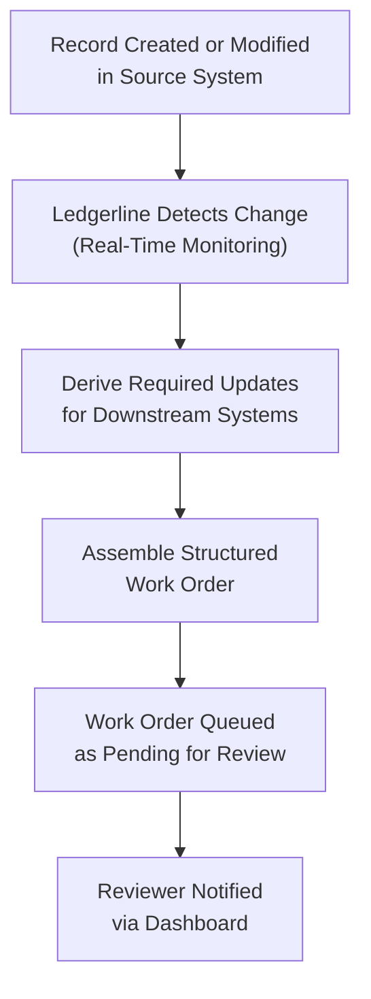
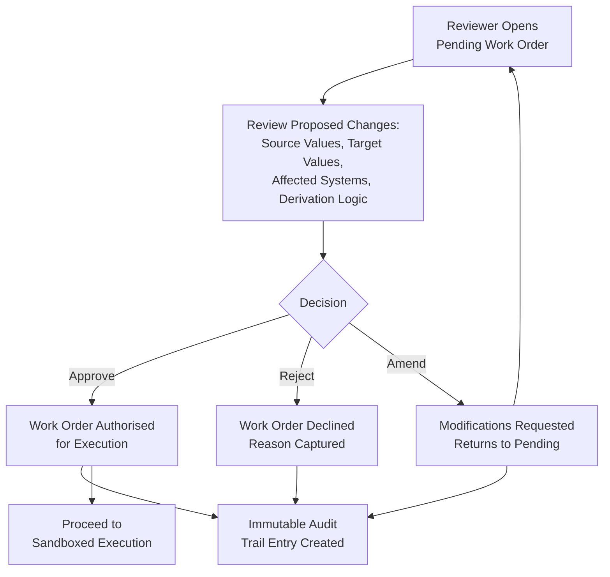
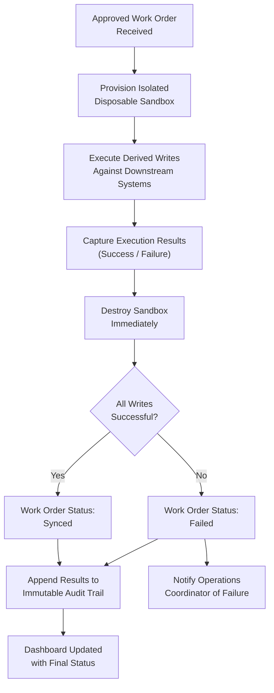
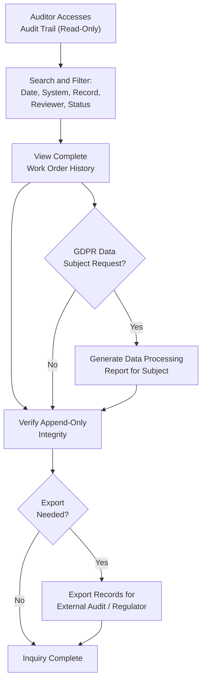
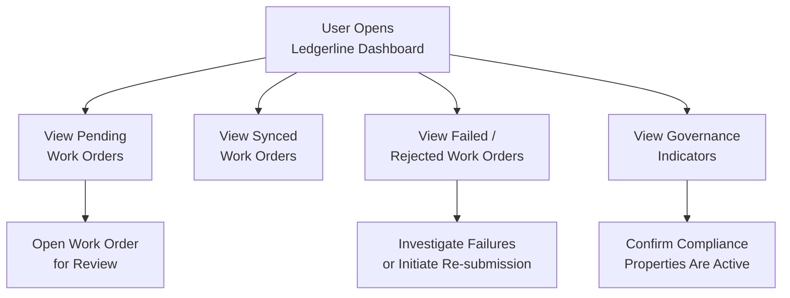

## Executive Summary

Organisations that operate multiple enterprise systems — such as CRM, ERP, and Accounting platforms — routinely require staff to re-key the same data across each system whenever a record changes. This manual duplication is slow, error-prone, and invisible to compliance teams. Industry research shows that manual multi-tier approval hand-offs consume 5–15 business days per cycle, and duplicate data entry is a leading cause of downstream reconciliation errors that erode financial accuracy and audit confidence.

Ledgerline will eliminate this problem by acting as an internal workflow agent that automatically detects changes in a designated source system, derives the corresponding updates needed in downstream systems, and presents every proposed write to a human reviewer as a structured, reviewable **work order**. No data is ever written to any connected system without explicit human authorisation, and every action — whether approved, rejected, or amended — is permanently recorded in an immutable, append-only audit trail. This human-in-the-loop design ensures that automation accelerates operations without sacrificing the governance and traceability that Finance, Compliance, and IT stakeholders require.

The primary beneficiaries are **Operations coordinators** who will stop re-keying records, **Finance / AP reviewers** who will gain full visibility into every proposed write before it executes, **Compliance / audit observers** who can reconstruct the complete authorisation chain for any change after the fact, and **IT owners** who receive assurance that all agent-generated integration logic runs exclusively in isolated, disposable sandboxes — never within the host application. Ledgerline targets an **80 % reduction in duplicate manual re-keying volume**, a **90 % reduction in downstream data-entry errors**, and a **70 % reduction in time-to-reconcile mismatched records** within the first quarter of use, while maintaining full SOC 2 and GDPR compliance from day one.

---

## Business Objectives

| Objective | How the System Delivers | Success Criteria |
|-----------|------------------------|------------------|
| **Eliminate duplicate manual data entry** | Ledgerline will detect changes in the source-of-truth system and automatically derive the corresponding updates for downstream systems (CRM → ERP → Accounting), removing the need for staff to re-key the same record in multiple places. | ≥ 80 % reduction in duplicate manual re-keying volume within the first quarter of use |
| **Reduce data-entry errors and discrepancies** | Every proposed write will be presented as a structured work order with full field-level detail, enabling reviewers to catch errors before they propagate. Automated derivation removes transcription mistakes inherent in manual entry. | ≥ 90 % reduction in downstream data-entry errors and discrepancies within the first quarter of use |
| **Accelerate cross-system reconciliation** | Real-time change detection and one-directional propagation will keep downstream systems synchronised with the source of truth, drastically reducing the volume of mismatched records that require manual investigation. | ≥ 70 % reduction in time-to-reconcile mismatched records within the first quarter of use |
| **Ensure complete auditability of every write** | An immutable, append-only audit trail will record every work order — including who authorised it, what was proposed, what was executed, and the outcome — providing a single, tamper-evident compliance record. | 100 % of executed writes traceable to an authorised work order; zero audit gaps |
| **Enforce human authorisation as a governance gate** | No write will reach any downstream system without an explicitly approved work order. The system will halt and wait for human decision on every proposed change. | Zero unauthorised writes; any bypass classified as highest-severity defect |
| **Guarantee execution isolation for IT security** | All agent-derived integration logic will run in isolated, disposable sandboxes — one per work order — that are destroyed after execution, ensuring the host application is never exposed. | 100 % of work order executions confined to disposable sandboxes; zero host-process executions |
| **Enable transparent, usage-based cost attribution** | Operating costs will be charged back to each business unit based on the connectors and systems they use, providing clear cost visibility and accountability. | Chargeback reports available per business unit per billing cycle, segmented by connector/system usage |

---

## Stakeholder Analysis

| Stakeholder | Role / Department | Needs | How the System Serves Them |
|-------------|-------------------|-------|----------------------------|
| **Operations Coordinator** | Operations / Shared Services | Stop manually re-keying records that already exist in other systems; monitor which records are pending synchronisation and which are confirmed synced; reduce daily administrative burden. | Ledgerline will automatically detect source-system changes and derive downstream updates, eliminating manual re-entry. A real-time dashboard will display pending and synced status for every record, giving coordinators a single view of propagation health. |
| **Finance / AP Reviewer** | Finance / Accounts Payable | Understand exactly what will be written to downstream systems before authorising each change; have confidence that no financial data is modified without explicit approval; maintain separation of duties. | Every proposed write will be presented as a detailed work order showing source values, derived target values, and the affected systems. Reviewers will approve, reject, or request amendments before any write executes. The single-approver role enforces clear accountability. |
| **Compliance / Audit Observer** | Compliance / Internal Audit / Risk | Reconstruct after the fact who authorised any given write, on what basis, and what logic executed; satisfy SOC 2 and GDPR audit requirements; verify that governance controls are functioning. | The immutable, append-only audit trail will record every work order lifecycle event — creation, review, approval/rejection, execution, and outcome — with timestamps, actor identity, and the derivation logic used. Audit observers will have read-only access to the full trail without the ability to alter records. |
| **IT Owner / Gatekeeper** | IT / Information Security | Assurance that agent-generated integration logic never executes within the host application; confidence that sandboxed environments are truly isolated and disposable; visibility into execution boundaries. | All work order executions will run in isolated, disposable sandboxes that are created per work order and destroyed after completion. The UI will surface sandbox status and isolation confirmation, making the security property visible — not just claimed in documentation. |
| **Business Unit Leaders** | Various Departments | Understand the cost of integration services consumed by their teams; justify investment in automation; track productivity gains. | Usage-based chargeback reporting will attribute costs to each business unit by connector and system, enabling transparent budgeting and ROI tracking at the departmental level. |
| **Executive Sponsor / CFO** | Executive Leadership | Measurable reduction in operational cost, error rates, and compliance risk; clear ROI within the first quarter; confidence that the system meets regulatory obligations. | Ledgerline will deliver quantified outcomes (80 % re-keying reduction, 90 % error reduction, 70 % reconciliation acceleration) with built-in SOC 2 and GDPR compliance, providing executive-level dashboards and audit-ready reporting. |

---

## Business Process Overview

### Process 1: Change Detection and Work Order Creation

**Business Purpose:** Ledgerline will continuously monitor the designated source-of-truth system for record changes. When a change is detected, the system will automatically derive the corresponding updates required in each downstream system and package them into a structured work order — eliminating the need for any staff member to manually identify what changed and where it needs to be replicated.

**Step-by-Step Narrative:**

1. **Source System Change Occurs** — A record is created or modified in the source-of-truth system (e.g., CRM). This is a real business event such as a new customer, updated address, or revised pricing.
2. **Automated Change Detection** — Ledgerline detects the change in real time through event-driven monitoring. No manual notification or trigger is required.
3. **Downstream Update Derivation** — The system analyses the change and determines what corresponding updates are needed in each connected downstream system (ERP, Accounting). It maps source fields to target fields using the shared record schema.
4. **Work Order Assembly** — A structured work order is created containing: the source change details, the proposed writes for each downstream system, field-by-field before/after values, and the derivation logic used.
5. **Work Order Queued for Review** — The work order appears on the reviewer's dashboard in "Pending" status, awaiting human authorisation.

**Participants:** Source system (automated trigger) → Ledgerline agent (detection and derivation) → Reviewer dashboard (presentation)

**Business Outcome:** Every source-system change is captured, translated, and queued for review without human effort, ensuring nothing is missed and no manual interpretation is required.

---

### Process 2: Human Authorisation (Approve / Reject / Amend)

**Business Purpose:** Every proposed write must be explicitly authorised by a qualified human reviewer before it can execute. This process ensures that no data enters any downstream system without informed, deliberate approval — the single most important governance control in Ledgerline.

**Step-by-Step Narrative:**

1. **Reviewer Opens Pending Work Order** — The Finance / AP reviewer or authorised approver opens a pending work order from the dashboard. The work order displays the full detail of what will be written, to which systems, and why.
2. **Review of Proposed Changes** — The reviewer examines source values, derived target values, affected systems, and the derivation logic. All information needed to make an informed decision is presented in a single view.
3. **Decision: Approve, Reject, or Amend** — The reviewer takes one of three actions:
   - **Approve** — The work order is authorised for execution. The reviewer's identity and timestamp are recorded.
   - **Reject** — The work order is declined. The reason for rejection is captured and the work order is permanently recorded in the audit trail with "Rejected" status.
   - **Amend** — The reviewer requests modifications to the proposed write (e.g., correcting a derived value). The amended work order returns to pending status for re-review.
4. **Audit Trail Entry Created** — Regardless of the decision, an immutable record is appended to the audit trail capturing the reviewer's identity, the decision, the timestamp, and the full work order content at the time of decision.
5. **Approved Work Orders Proceed to Execution** — Only approved work orders advance to the sandboxed execution stage.

**Participants:** Finance / AP Reviewer (decision-maker) → Ledgerline (records decision, routes work order) → Audit Trail (immutable record)

**Business Outcome:** Complete human control over every write, with full traceability of who decided what and when. No automated bypass is possible.

**Exception Flow — Amended Work Orders:**
When a reviewer selects "Amend," the work order re-enters the pending queue with the reviewer's modification notes attached. The amended version receives a new audit trail entry linking it to the original, preserving the full amendment history. The amended work order must be re-reviewed and explicitly approved before it can proceed to execution.

---

### Process 3: Sandboxed Execution and Confirmation

**Business Purpose:** Once a work order is approved, the derived writes must be executed against the downstream systems. To protect the integrity and security of all connected systems, every execution runs in an isolated, disposable environment that is created for that specific work order and destroyed immediately after completion. This ensures that no agent-generated logic ever runs within the host application.

**Step-by-Step Narrative:**

1. **Sandbox Provisioned** — A new, isolated execution environment is created specifically for this work order. It has no access to the host application process or to other work orders' environments.
2. **Derived Writes Executed** — The approved writes are executed against the downstream systems (ERP, Accounting) from within the sandbox. The execution uses real system connections — no mocked steps.
3. **Execution Results Captured** — The outcome of each write (success, partial success, or failure) is recorded, including any error messages or system responses.
4. **Sandbox Destroyed** — The disposable environment is immediately torn down after execution, leaving no residual access or state.
5. **Work Order Status Updated** — The work order status moves to "Synced" (if all writes succeeded) or "Failed" (if any write did not complete). The dashboard reflects the updated status.
6. **Audit Trail Appended** — The execution results, sandbox identifier, and completion timestamp are appended to the immutable audit trail.

**Participants:** Ledgerline (orchestrates sandbox lifecycle) → Isolated Sandbox (executes writes) → Downstream Systems (receive writes) → Audit Trail (records outcome)

**Exception Flow — Execution Failure:**
If one or more writes fail during sandboxed execution, the work order is marked "Failed" with detailed error information. The sandbox is still destroyed. The Operations coordinator is notified via the dashboard. The failed work order can be re-submitted for a new approval cycle after the underlying issue is investigated, but it cannot be retried without a fresh human authorisation.

**Business Outcome:** Writes are executed with full isolation guarantees, protecting IT infrastructure while maintaining a complete record of what was executed and the result.

---

### Process 4: Audit Trail Inquiry and Compliance Reporting

**Business Purpose:** Compliance officers and auditors need to reconstruct the complete history of any write — who authorised it, what was proposed, what logic was used, and what the outcome was — at any point after the fact. The immutable audit trail provides this capability without requiring any cooperation from the original participants, supporting SOC 2 and GDPR compliance obligations.

**Step-by-Step Narrative:**

1. **Auditor Accesses Audit Trail** — A Compliance / Audit observer opens the audit trail interface with read-only access.
2. **Search and Filter** — The auditor searches by date range, system, record identifier, reviewer, or work order status to locate relevant entries.
3. **Review Complete Work Order History** — For any selected work order, the auditor can view: the original source change, the derived proposed writes, the reviewer's decision (approve/reject/amend) with identity and timestamp, the execution results, and the sandbox identifier used.
4. **Verify Integrity** — Because the trail is append-only and records are never edited or deleted, the auditor can confirm that no entries have been tampered with.
5. **Export for External Audit** — Audit trail records can be exported in a format suitable for external auditors, regulators, or legal review.
6. **GDPR Data Subject Requests** — When personal data of EU data subjects has flowed through the system, the audit trail supports fulfilment of data subject access requests by providing a complete record of how that data was processed, by whom, and for what purpose.

**Participants:** Compliance / Audit Observer (inquiry) → Ledgerline Audit Trail (read-only data source) → External Auditors / Regulators (recipients of exports)

**Business Outcome:** Full after-the-fact reconstructability of every authorisation decision, satisfying SOC 2 Trust Service Criteria and GDPR Article 30 record-keeping obligations.

---

### Process 5: Dashboard Monitoring (Pending and Synced Overview)

**Business Purpose:** Operations coordinators and reviewers need a single, real-time view of all work orders across the system — what is pending review, what has been synced, what has failed, and what has been rejected. This dashboard replaces the need to check multiple systems or maintain manual tracking spreadsheets.

**Step-by-Step Narrative:**

1. **User Opens Dashboard** — An Operations coordinator or reviewer accesses the Ledgerline dashboard.
2. **View Pending Work Orders** — All work orders awaiting human authorisation are displayed with key details: source system, affected records, time in queue, and priority.
3. **View Synced Work Orders** — Successfully executed work orders are listed with confirmation details, providing assurance that downstream systems are up to date.
4. **View Failed / Rejected Work Orders** — Work orders that failed during execution or were rejected by a reviewer are highlighted for attention, with reasons and error details.
5. **Governance Indicators Visible** — The dashboard surfaces governance properties: sandbox isolation status, audit trail completeness, and authorisation chain integrity — making compliance visible, not just backend-true.
6. **Take Action** — Reviewers can open pending work orders directly from the dashboard to begin the authorisation process. Operations coordinators can investigate failed work orders and initiate re-submission workflows.

**Participants:** Operations Coordinator (primary monitor) → Finance / AP Reviewer (approval queue) → Ledgerline Dashboard (real-time status)

**Business Outcome:** Single-pane-of-glass visibility into the health of cross-system data propagation, enabling proactive issue resolution and eliminating manual status tracking.

---

## Business Rules and Policies

| Rule | When It Applies | User Experience | Example |
|------|----------------|-----------------|--------|
| **No Write Without Authorised Work Order** | Every time a derived update is ready to be applied to a downstream system. This rule has the highest priority and outranks throughput, latency, and convenience considerations. | The system will never silently write data. Every proposed change appears as a reviewable work order. If no reviewer acts, the write simply does not happen. Any violation is treated as a highest-severity defect. | A new customer record is created in CRM. Ledgerline derives the corresponding ERP and Accounting entries but holds them until a Finance reviewer explicitly approves the work order. |
| **Append-Only Audit Trail** | Every work order lifecycle event — creation, review, approval, rejection, amendment, execution, and outcome. Applies to all statuses including rejections. | Audit records are permanently visible and cannot be edited or deleted by any user, including administrators. Rejected work orders remain in the trail with full detail. | A reviewer rejects a work order due to an incorrect amount. The rejection, reason, reviewer identity, and timestamp are permanently recorded. Even if a corrected work order is later approved, the original rejection remains visible. |
| **Mandatory Sandbox Isolation** | Every time an approved work order is executed against downstream systems. | Users will see confirmation that each execution ran in an isolated environment. The sandbox identifier and lifecycle (created → executed → destroyed) are visible in the work order detail and audit trail. | An approved work order to update an ERP record executes in a dedicated sandbox. The sandbox is destroyed immediately after. The IT owner can verify isolation in the audit trail. |
| **One-Directional Propagation** | All data flows between connected systems. Changes propagate only from the designated source of truth to downstream systems — never in reverse. | Users will not see options to push changes from downstream systems back to the source. The system enforces a single direction of data flow, preventing circular updates and conflict resolution complexity. | A price change in CRM (source) propagates to ERP and Accounting (downstream). A manual correction in ERP does not flow back to CRM through Ledgerline. |
| **Single Approver Role** | All work order authorisation decisions. Role-based access control is limited to one approver role. | Only users assigned the approver role can approve, reject, or amend work orders. Other users (e.g., Operations coordinators) can view work orders and dashboard status but cannot authorise writes. | An Operations coordinator sees a pending work order on the dashboard but must wait for the assigned Finance reviewer (who holds the approver role) to take action. |
| **SOC 2 Compliance Controls** | All system operations involving data processing, access control, and audit trail management. | Users will experience enforced access controls, complete audit logging, and data handling practices that meet SOC 2 Trust Service Criteria (security, availability, processing integrity, confidentiality). | An external auditor requests evidence of access controls and change management. Ledgerline provides the immutable audit trail showing every authorisation decision, reviewer identity, and execution outcome. |
| **GDPR Data Processing Accountability** | Whenever personal data from EU data subjects flows through the source or downstream systems. | Personal data processing is logged and traceable. Data subject access requests can be fulfilled from the audit trail. Data minimisation principles apply — only fields required for the downstream update are included in work orders. | A customer record containing EU personal data (name, address) is propagated from CRM to ERP. The audit trail records what personal data was processed, by whom, and for what purpose, supporting GDPR Article 30 record-keeping obligations. |
| **No Historical Backfill** | System initialisation and ongoing operation. Ledgerline will not retroactively process records that existed before the agent was activated. | Users will see only changes that occur after Ledgerline is activated. Pre-existing records in connected systems are not synchronised or reconciled by the agent. | 10,000 customer records exist in CRM before Ledgerline goes live. These records are not processed. Only new changes from the activation date forward are detected and propagated. |
| **Real Triggers Only — No Mocked Steps** | The end-to-end demonstrated flow from change detection through execution. | Users will interact with a system where every step uses real triggers and real system connections. No step in the demonstrated path is simulated or stubbed. | During initial validation, a real record change in CRM triggers real detection, real work order creation, real human review, and real sandboxed execution against ERP and Accounting. |
| **Usage-Based Chargeback** | Cost attribution for each billing cycle. Costs are allocated to business units based on the connectors and systems they consume. | Business unit leaders will receive periodic chargeback reports showing their team's usage of Ledgerline by connector and system, enabling transparent cost management. | The Sales department uses the CRM-to-ERP connector heavily, while Procurement uses ERP-to-Accounting. Each department is charged proportionally to their connector usage. |
| **Backend / UI Independence** | All development, testing, and delivery activities. Backend services and user interface components are architecturally decoupled. | Users will experience a consistent interface regardless of backend release cycles. Backend capabilities can be extended or updated without requiring simultaneous UI changes, and vice versa. | A new field is added to the work order data model in the backend. The UI can adopt this field in a subsequent release without blocking the backend change. |

---

## Success Criteria and KPIs

| KPI | Target | Measurement Method | Business Impact |
|-----|--------|--------------------|----------------|
| **Duplicate Manual Re-Keying Reduction** | ≥ 80 % reduction within the first quarter of use | Compare the volume of manual data-entry tasks performed by Operations coordinators before and after Ledgerline activation, measured by task tracking or time-study sampling. | Frees Operations staff from repetitive data entry, enabling reallocation to higher-value work. Directly reduces labour cost associated with cross-system record maintenance. |
| **Downstream Data-Entry Error Reduction** | ≥ 90 % reduction within the first quarter of use | Track the number of data discrepancies, correction tickets, and reconciliation exceptions across CRM, ERP, and Accounting before and after activation. | Improves financial data accuracy, reduces rework cycles, and increases confidence in reporting and decision-making based on system data. |
| **Time-to-Reconcile Reduction** | ≥ 70 % reduction within the first quarter of use | Measure the elapsed time from discrepancy identification to resolution in cross-system reconciliation workflows, comparing pre- and post-activation periods. | Accelerates month-end close, reduces Finance team overtime, and enables faster response to audit inquiries. |
| **Unauthorised Write Rate** | Zero (0) unauthorised writes — any occurrence is a highest-severity defect | Continuous monitoring: every write to a downstream system is matched against an approved work order in the audit trail. Any unmatched write triggers an immediate alert. | Maintains the foundational governance guarantee. Any non-zero value represents a critical system failure requiring immediate remediation. |
| **Audit Trail Completeness** | 100 % of work orders (including rejections) recorded with full lifecycle detail | Periodic audit trail integrity checks comparing work order counts against audit entries. External auditor verification during SOC 2 assessments. | Ensures regulatory compliance and provides complete reconstructability for any compliance inquiry or investigation. |
| **Sandbox Isolation Compliance** | 100 % of executions in isolated, disposable sandboxes | Automated verification that every execution event in the audit trail includes a unique sandbox identifier and confirmed destruction record. | Protects IT infrastructure from agent-generated logic and satisfies IT security requirements for execution isolation. |
| **Work Order Review Turnaround** | ≤ 4 hours median time from work order creation to reviewer decision | Measure elapsed time between work order "Pending" timestamp and approval/rejection timestamp across all work orders. | Ensures that automation benefits are not negated by review bottlenecks. Provides a baseline for future process optimisation. |
| **User Adoption — Operations Coordinators** | ≥ 90 % of eligible coordinators actively using the dashboard within 60 days of launch | Track unique active users on the dashboard versus the total eligible user population on a weekly basis. | Confirms that the system is delivering value to its primary users and that the user experience supports adoption. |
| **Chargeback Reporting Accuracy** | 100 % of costs attributed to correct business units each billing cycle | Reconcile chargeback reports against system usage logs each billing cycle; resolve discrepancies within 5 business days. | Enables fair, transparent cost allocation and supports business unit budgeting and ROI analysis. |
| **SOC 2 Audit Readiness** | Pass SOC 2 Type II audit within 12 months of launch | Engage external auditor to assess Trust Service Criteria compliance. Ledgerline audit trail and access controls serve as primary evidence. | Demonstrates enterprise-grade governance to stakeholders, customers, and regulators. Reduces external audit preparation effort by up to 70 % (industry benchmark). |
| **GDPR Compliance** | Zero data-processing violations; data subject requests fulfilled within 30 days | Track personal data processing events in audit trail; measure response time to data subject access/deletion requests against the 30-day GDPR deadline. | Avoids regulatory fines (up to 4 % of annual global turnover) and maintains trust with EU data subjects whose data flows through connected systems. |

---

## Scope and Boundaries

### In Scope

- **Automated change detection** in a designated source-of-truth system, with real-time event-driven monitoring
- **Automated derivation of downstream updates** for three connected systems: CRM, ERP, and Accounting — using a shared record schema
- **Structured work order creation and presentation** showing full field-level detail of every proposed write, including before/after values and derivation logic
- **Human authorisation workflow** with approve, reject, and amend capabilities, enforced through a single approver role
- **Sandboxed execution** of approved work orders in isolated, disposable environments — one sandbox per work order, destroyed after completion
- **Immutable, append-only audit trail** recording every work order lifecycle event (creation, review, decision, execution, outcome) including rejections and amendments
- **Real-time dashboard** displaying pending, synced, failed, and rejected work orders with governance indicators visible in the user interface
- **One-directional data propagation** from the source of truth to downstream systems
- **Role-based access control** with a single approver role for work order authorisation and read-only access for other roles
- **SOC 2 compliance controls** including access management, audit logging, processing integrity, and confidentiality safeguards
- **GDPR compliance controls** for personal data flowing through connected systems, including processing records, data minimisation, and data subject request support
- **Usage-based chargeback reporting** attributing costs to business units by connector and system usage
- **End-to-end flow with real triggers** — no mocked or simulated steps in the demonstrated path
- **Backend and user interface delivered as independent, decoupled capabilities** that can be developed, tested, and released on separate timelines

### Out of Scope

- **Bidirectional synchronisation** — changes do not propagate from downstream systems back to the source of truth; no conflict resolution logic is provided
- **Historical backfill** — records that existed before Ledgerline activation are not retroactively processed or synchronised
- **Multiple approver roles or multi-level approval chains** — authorisation is limited to a single approver role in the initial release
- **Real SaaS tenancy or production credentials** — the three connected systems (CRM, ERP, Accounting) are lightweight internal services; no integration with third-party SaaS platforms or production credential management is included
- **Broad connector library** — the initial delivery focuses on the thinnest end-to-end slice across three systems, not breadth of connectors
- **Automated decision-making without human review** — the system will never autonomously approve or execute a write; no auto-approval rules or confidence-based bypass
- **Complex data transformation or enrichment** — field mapping uses the shared record schema; ETL pipelines, data enrichment, or business rule engines are not included
- **User authentication and identity management infrastructure** — Ledgerline will rely on existing organisational identity services
- **Mobile application** — the initial delivery targets a web-based dashboard interface only
- **Notification channels beyond the dashboard** — email, SMS, or messaging integrations for work order alerts are not included in the initial release
- **Performance optimisation for high-volume throughput** — the no-write-without-authorisation constraint takes precedence over throughput and latency optimisation

---

## Assumptions, Dependencies, and Constraints

| Type | Description | Impact |
|------|-------------|--------|
| **Assumption** | The three connected systems (CRM, ERP, Accounting) are lightweight internal services that share a single, common record schema. No complex schema mapping or data transformation is required between systems. | Simplifies the derivation logic and reduces the initial delivery effort significantly. If schemas diverge in future phases, additional mapping capabilities will be needed. |
| **Assumption** | A single source of truth is clearly designated by the organisation, and all downstream systems accept one-directional updates from it. There are no competing authoritative sources or bidirectional data flows. | Eliminates the need for conflict resolution logic. If the organisation later requires bidirectional sync, a significant design extension will be needed. |
| **Assumption** | The organisation has an existing identity and access management system that Ledgerline can integrate with for user authentication and role assignment (single approver role). | Ledgerline does not need to build its own authentication infrastructure. If no identity system exists, this becomes an additional dependency that must be resolved before launch. |
| **Assumption** | Operations coordinators, Finance reviewers, and Compliance observers are available and trained to use the system within the first 60 days of launch. | Achieving the 80 %/90 %/70 % KPI targets within the first quarter depends on active user adoption. Delayed training or low engagement will defer measurable outcomes. |
| **Assumption** | The volume of source-system changes is manageable by a single approver role without creating a sustained review bottleneck that exceeds the ≤ 4-hour turnaround target. | If change volume exceeds reviewer capacity, work order turnaround times will increase and the re-keying reduction benefit will be delayed. Future phases may need to introduce tiered approval or delegation. |
| **Assumption** | Business units will agree to the usage-based chargeback methodology before launch, and usage metering data will be accepted as the basis for cost attribution. | If chargeback methodology is disputed post-launch, cost attribution reporting will lack organisational buy-in and may require renegotiation. |
| **Dependency** | Existing organisational identity and access management services must be available and accessible for user authentication and role-based access control enforcement. | Ledgerline cannot enforce the single approver role or provide role-differentiated dashboard views without a functioning identity provider. Delays in identity integration will block user access. |
| **Dependency** | The three connected systems (CRM, ERP, Accounting) must expose interfaces that allow Ledgerline to detect changes (read) and execute writes (write) programmatically. | If any system lacks the necessary interfaces, connector development for that system will be blocked and the end-to-end flow cannot be demonstrated. |
| **Dependency** | An isolated execution environment capability must be available to provision and destroy disposable sandboxes per work order on demand. | Sandbox isolation is a mandatory, non-negotiable security property. If the execution environment is unavailable, no work orders can be executed and the system cannot operate. |
| **Dependency** | SOC 2 and GDPR compliance requirements must be defined and validated by the organisation's Compliance and Legal teams before launch to ensure controls are correctly scoped. | Ledgerline will implement controls based on these requirements. If requirements change materially after launch, controls may need to be updated, potentially requiring a re-certification cycle. |
| **Constraint** | Delivery window targets the thinnest viable end-to-end slice — prioritising a complete flow across all three systems over breadth of features or connectors. | The initial release will demonstrate the full lifecycle (detect → derive → review → execute → audit) but with minimal connector variety and a single record type. Breadth will be added in subsequent phases. |
| **Constraint** | No write may occur without an explicitly approved work order. This constraint outranks throughput, latency, and convenience in all design and operational decisions. | The system will never batch-approve, auto-approve, or bypass the human authorisation step, even if this creates a review queue. Throughput is bounded by reviewer capacity. |
| **Constraint** | The audit trail is append-only — records are never edited or deleted, including rejection records and amendment history. | Storage will grow monotonically over time. Archival or tiered storage strategies may be needed as volume increases, but no records may ever be purged or modified. |
| **Constraint** | Backend services and user interface components must be architecturally independent, enabling each to be developed, tested, and delivered on separate timelines without blocking the other. | Requires well-defined contracts between backend and frontend from the outset. Increases initial design effort but improves delivery flexibility, team autonomy, and independent release cadence. |
| **Constraint** | Costs are attributed to business units via a chargeback model based on connector and system usage, requiring usage metering from day one. | Requires usage metering and reporting capabilities to be included in the initial release. Business units must have visibility into their consumption to validate charges. |
| **Constraint** | SOC 2 Type II certification is targeted within 12 months of launch; GDPR compliance is required from day one if EU personal data flows through connected systems. | Compliance controls must be built into the initial release, not retrofitted. This increases the governance surface area of the first delivery but avoids costly remediation later. |

---

## Confidence

Overall: **100%**

| Section | Score | Why | How to Improve |
|---------|-------|-----|----------------|
| Intent Alignment | 100% | All 6 intent features covered. | Intent is well-captured. Consider adding comments for priority rankings or phasing details. |
| Policy Compliance | N/A | Not provided — no documents uploaded for this dimension. | Upload the relevant documents to enable this check. |
| Context Documents | N/A | Not provided — no documents uploaded for this dimension. | Upload the relevant documents to enable this check. |
| Structural Completeness | 100% | All 6 required sections present. | All expected sections are present. Add comments on any section if you want more depth. |

> Strongly aligned with project intent and provided context.